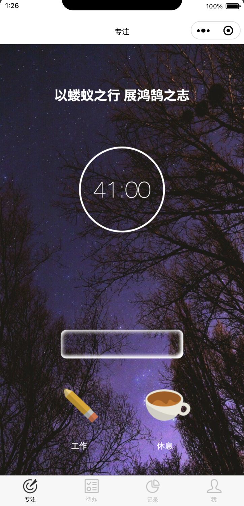
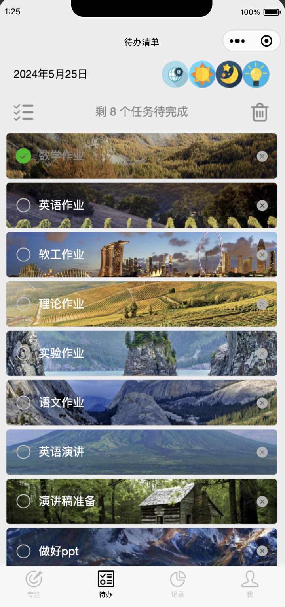
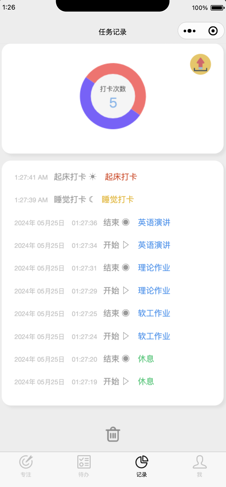
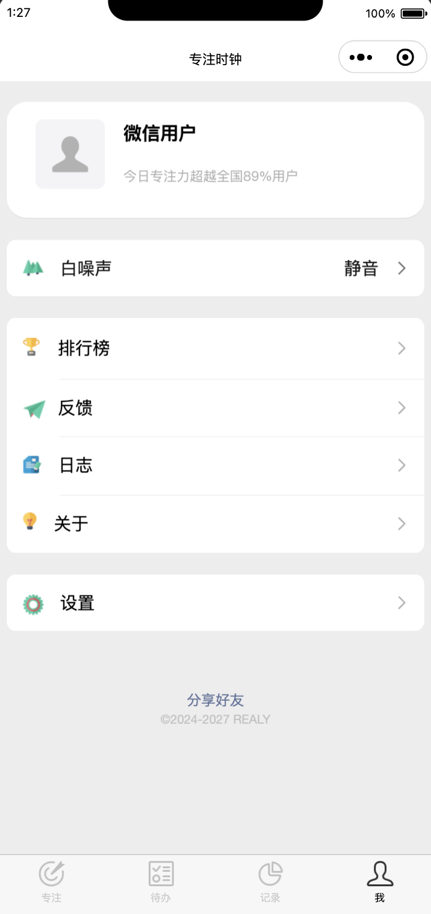

## FocusToDo
[📄[Document](https://github.com/Dwl2021/FocusToDo-MiniProgram/blob/main/document.pdf)] &emsp; [💻[Platform](https://mp.weixin.qq.com/cgi-bin/wx)] &emsp;  

### 🌟 Collaborators 🌟

All collaborators are students from the School of Intelligent Systems Engineering , Sun Yat-sen University, Class of 2021.

- **Weiliang Deng**  
  📧 Email: dengwliang@mail2.sysu.edu.cn

- **Weichen Lyu**  
  📧 Email: lvwch@mail2.sysu.edu.cn

- **Hang Xiang**  
  📧 Email: xiangh9@mail2.sysu.edu.cn

- **Xinshen Fu**  
  📧 Email: fuxsh3@mail2.sysu.edu.cn

- **Jiarui Ouyang**  
  📧 Email: ouyjr@mail2.sysu.edu.cn

### 📸 Screenshots

    
    
    
    

