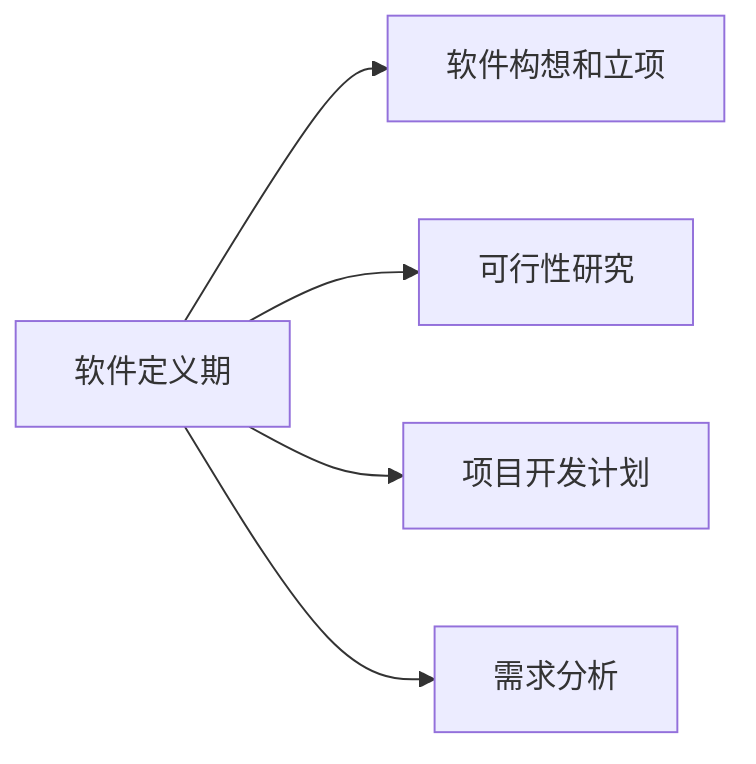
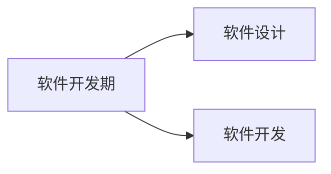
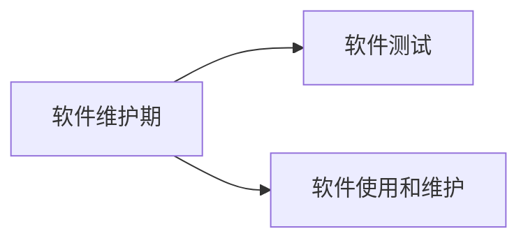

# ***软件工程（含实验）期末课程设计***

<center><div style='height:2mm;'></div><div style="font-family:华文楷体;font-size:12pt;">邓伟亮，傅信燊，吕韦辰，欧阳家睿，向航 *</div></center>
<center><span style="font-family:华文楷体;font-size:10pt;line-height:9mm">中山大学（深圳校区） 智能工程学院 528406</span></center>
<center><div style='height:2mm;'></div><div style="font-family:华文楷体;font-size:12pt;">* 所有作者为同等贡献，按姓名首字母排序</div></center>


# 前言

**我们将这个项目的完成过程拆解成了多个部分，每个部分都对应单独的pdf文档，加起来共有11份报告和文档，但为了方便老师助教们查看审阅以及评分，我们将这11份报告加以修改，整合为这一份总报告，本报告分为5个部分，每个部分对应着大作业的评分要求：**

**【立项目的+可行性调研（30%）、需求分析（25%）、主要设计（15%）、基本实现+测试过程（25%）、经济性和前景分析（5%）】**

**如果老师助教们对某部分内容有疑惑时，可以查看与本报告在同级目录下的其他小报告，它们会描述得更加详细一点～**


---

# 目录

**一、立项目的及可行性调研**

1. 问题定义报告
2. 可行性研究报告
3. 开发计划文档

**二、需求分析**

1. 需求分析报告
2. 前期调研(作为需求分析报告的一部分或附录)

**三、主要设计**

1. 软件设计说明书
2. 软件接口文档

**四、基本实现及测试过程**

1. 软件测试计划书
2. 测试分析报告
3. 用户手册

**五、项目分析**

1. 项目经济性分析

2. 项目前景分析


# ***第一部分：立项目的及可行性调研：***

# 问题定义

在快速发展的数字时代，智能设备尤其是智能手机已经成为人们生活和工作中不可或缺的一部分。然而，这种技术的普及也带来了一系列挑战，其中最显著的是它对人们专注力的影响。学生和职场人士经常发现自己难以在持续的干扰中保持专注，这不仅影响了他们的生产效率，也对心理健康产生了负面影响。鉴于此，开发一款帮助用户管理时间和提高专注度的工具变得尤为重要。

## 工程项目名称

 本项目旨在开发一款名为“FocusToDo”的帮助用户放下手机，聚焦于学习或工作的集时钟、锁机以及统计专注时长于一体的微信小程序软件。

## 软件项目使用单位和部门

**在符合中华人民共和国法律条文的规定下，本软件对所有中国公民完全免费开放使用。**

本软件开源于GitHub项目托管平台，使用MIT许可证，项目地址: 

https://github.com/Dwl2021/Focus-MiniProgram

## 软件项目开发单位

软件开发单位由中山大学智能工程学院2021级智能科学与技术专业的五名学生组成：

邓伟亮：21312747、吕韦辰：21312673、傅信燊：21312463、向航：21312505、欧阳家睿：21312714

## 问题的概括定义

在当今社会，数字化设备尤其是智能手机已成为人们日常生活中不可或缺的一部分。然而，这种普及也带来了显著的分散注意力问题，尤其是在人们需要长时间集中精力的学习和工作的场景下。智能手机的不断通知和吸引用户注意力的应用程序常常导致用户的专注时间大幅削减，进而影响用户工作效率和学习效果。

为应对这一挑战，本团队开发的微信小程序“FocusToDo”旨在帮助用户管理其对智能设备的使用，通过技术手段减少分心情况，从而提高专注度和生产力。软件通过集成倒计时时钟、设备锁定功能和专注时长统计等功能，使用户能够设定专注时间，在此期间限制手机的功能性使用，仅保留一些必要的功能使用（如需紧急联系）。此外，通过统计和反馈用户的专注时间，软件还鼓励用户通过可视化的进度和成就，形成良好的时间管理习惯。

我们希望“FocusToDo”不仅可以解决了现代社会中普遍存在的注意力分散问题，还可以通过提供工具和数据支持，帮助用户自我提升其日常工作和学习的效率。当软件被成熟地开发后，我们也希望“FocusToDo”成为用户提高个人生产力的强有力助手，尤其适用于学生群体和专业人士。

## 软件项目的用途和目标

“FocusToDo”的主要用途是帮助用户摆脱智能设备带来的干扰，专注于当前的学习或工作任务。用户可以设定具体的专注时间段，在这段时间内，软件将限制手机的部分功能，仅允许紧急通信，从而减少干扰和分心的情形。此外，软件还具备任务管理功能，允许用户根据自己的日程安排专注时间，安排和跟踪个人的学习或工作任务。通过这些功能，用户可以更有效地管理时间，提高工作和学习的效率。

受到团队成员知识以及能力水平的限制，“FocusToDo”不能像专业软件一样成熟，但本团队希望通过努力，尽力开发一款高效好用的软件，以期实现如下目标：

1. 提高用户专注力。通过让用户自定义专注时长，使用户在关键的工作或学习时间内远离手机干扰，提高专注力和效率。
2. 增强时间管理能力。引导用户通过计划和跟踪专注时间，学习有效的时间管理技巧，从而在日常生活中更好地安排和利用时间。
3. 形成健康的学习和工作习惯。通过对“FocusToDo”的一段时间使用，用户可以逐渐形成定期专注的习惯，改善学习和工作的习惯。
4. 提供实时反馈和进度跟踪。软件将提供实时的专注时间统计和历史数据分析，使用户能够直观地看到自己的时间使用情况和进步，从而激励用户继续改进和维持专注。

## 软件项目的类型和规模

"FocusToDo"是一款微信小程序，属于生产力工具类应用。这类应用旨在帮助用户提高工作和学习的效率，通过技术手段解决手机分散注意力的问题。微信小程序是一种不需要下载安装的应用，用户可以直接在微信内搜索并使用，极大地方便了用户的接入和使用。

开发"FocusToDo"小程序将使用微信官方提供的开发环境，即微信小程序IDE（集成开发环境）。这个环境提供了一套完整的开发工具，支持使用WXML、WXSS、JavaScript和JSON进行开发。此外，微信小程序还支持后端服务的接入，比如使用WeChat Pay进行支付集成或利用微信的云开发平台来处理数据存储和服务器逻辑。

考虑到"FocusToDo"主要功能包括时钟、锁机以及专注时长统计，其开发复杂度属于中等规模的项目。项目将涉及前端界面设计、后端数据处理以及与微信生态系统的整合，例如用户数据的管理和接口的调用。

## 软件项目开发的开始时间和预计交付使用时间

本项目开发的开始时间是2024年4月1日，预计交付时间是2024年5月10日。


# 可行性研究

## 前言

### 编写目的

本可行性研究报告的主要目的是综合评估“FocusToDo”微信小程序项目的实施可行性，确保项目在技术、操作和社会层面的实施是切实可行的。通过深入分析，本报告旨在确认该项目的技术可行性、评估操作可行性和探索社会可行性。

通过这一可行性研究，我们希望能够全面了解“FocusToDo”项目的各项实施条件和潜在风险，为项目的后续开发和实施提供科学、合理的建议和支持。

### 项目背景

开发软件名称：FocusToDo

项目开发者：邓伟亮、吕韦辰、向航、傅信燊、欧阳家睿

用户：学生以及办公人士

软件：软件依托微信开发者平台IDE进行开发

### 参考资料

张海藩，《软件工程导论》，北京，清华大学出版社

郑人杰等，《实用软件工程》，北京，清华大学出版社

## 背景和现状

在快速发展的数字时代，智能设备尤其是智能手机已经成为人们生活和工作中不可或缺的一部分。然而，这种技术的普及也带来了一系列挑战，其中最显著的是它对人们专注力的影响。学生和职场人士经常发现自己难以在持续的干扰中保持专注，这不仅影响了他们的生产效率，也对心理健康产生了负面影响。鉴于此，开发一款帮助用户管理时间和提高专注度的工具变得尤为重要。

“FocusToDo”项目应运而生于数字化时代，面向需要提高时间管理能力的学生及职场人士。此软件旨在通过提供专注管理工具，帮助用户减少这种干扰，优化其日常工作和学习效率。我们开发此软件的初衷是解决用户在面对诸多数字干扰时的专注力下降问题，同时提供一个简洁有效的界面，让用户轻松设定专注时间和任务，从而提高个人生产力和时间管理技巧。此外，通过集成时钟、锁机以及统计专注时长的功能，用户可以更好地监控和规划他们的日常活动。

当前，微信小程序作为一个平台，已经拥有广泛的开发者社区和成熟的开发工具。微信官方提供的开发环境IDE支持使用WXML、WXSS、JavaScript和JSON等技术进行小程序的开发，使得开发过程更为便捷和高效。针对“FocusToDo”，这意味着可以利用现有技术快速实现产品原型，并进行迭代优化。随着技术的进步和用户需求的不断变化，小程序平台持续推出新的功能和优化措施，以支持更加丰富和高效的应用场景。因此，开发“FocusToDo”小程序不仅是技术上可行的，而且可以充分利用微信平台的强大功能和广泛用户基础。

## 技术可行性分析

### 技术需求评估

在开发“FocusToDo”的过程中，我们首先需要确定使用的软件工具、硬件设备以及可能需要整合的第三方服务。作为微信小程序开发者，我们选择微信开发者平台IDE进行开发，这是因为它提供了一套完整的开发工具和环境，包括微信开发者工具（IDE），它支持使用 JavaScript、WXML，和WXSS。

我们将依托微信云开发框架，这不仅简化了开发过程，还提供了数据库、文件存储、云函数等强大的后端能力，这对于实现“FocusToDo”中的用户数据统计和时长跟踪等功能至关重要。

### 技术资源现状

在技术资源方面，我们团队具备扎实的前端开发经验及微信小程序开发知识。所有团队成员都曾参与过微信小程序的开发项目，熟悉微信的开发规范和API使用。此外，我们有稳定的网络环境和访问微信开发者工具的能力，这为我们的开发工作提供了必要的硬件支持。

我们团队还可以访问丰富的在线文档和社区支持，包括微信官方文档和各种开发者论坛。这些资源为我们解决开发中遇到的技术问题提供了便利。另外，微信的官方技术支持团队也能提供必要的技术咨询和问题解答。

### 技术障碍与解决方案

我们团队在开发过程中仍可能面临一些技术障碍。例如，微信小程序的性能优化是一个常见挑战，特别是在处理大量数据和复杂界面时。为了解决这一问题，我们计划采用分页加载和懒加载技术来优化数据的加载速度和减少内存消耗。此外，对于数据存储和管理，我们将使用微信云数据库，它提供了高效的数据读写能力，并且具备良好的扩展性。

我们还可能遇到用户设备兼容性问题。由于用户使用的设备和操作系统版本多样，这可能影响小程序的表现和功能。为此，我们将在开发过程中使用微信提供的模拟器进行广泛的测试，并在不同型号和版本的设备上进行实机测试，确保“FocusToDo”在各种环境下都能稳定运行。

## 操作可行性分析

### 用户界面与交互设计

在开发过程中，我们高度重视用户界面的设计以及提升用户体验，确保软件操作简便、直观，并且符合目标用户群体的技术水平和操作习惯。为了达到这个目标，我们进行了以下几个方面的工作：

1. **用户研究**：我们通过问卷调查的方式进行了初步的用户调研，了解我们的主要用户群体—学生的具体需求和使用习惯。这些信息帮助我们在设计阶段做出了数据驱动的决策。

   

   从问卷调查结果的柱状图中可以得到以下分析：

   1. **调查人群分布**：男性占55%，女性占45%。男性略多于女性，但两者比例相差不大。主要集中在18-25岁年龄段，占比60%。26-35岁年龄段次之，占比21%。其他年龄段（<18岁、36-45岁、>46岁）占比较少。
   2. **微信使用频率**：绝大多数人表示每天都会使用微信，占比90%。少部分人表示每天只使用一次，而几乎没有人表示很少或从不使用微信。
   3. **是否愿意尝试使用FocusToDo**：绝大多数人表示愿意尝试使用FocusToDo，占比95%。只有很少一部分人表示不愿意尝试。
   4. **手机使用时间**：手机使用时间主要集中在2-4小时之间，占比30%。其次是4-6小时，占比25%。使用时间少于1小时和超过6小时的人数相对较少。
   5. **手机使用目的**：主要使用目的是娱乐，占比45%。其次是学习，占比35%。工作和其他目的的使用人数相对较少。

   调查证明绝大多数人愿意尝试使用FocusToDo微信小程序，这表明对此类时间管理工具的需求较大。

2. **界面设计**：基于调研结果，我们设计了一套简洁而直观的用户界面。为了用户能够轻松地进行任务设定和时间管理，我们为小程序设计了大按钮和清晰的标签。我们也特别考虑到了色彩的使用，选择了对视觉舒适度和注意力集中有积极影响的颜色方案。

3. **交互流程优化**：为了使用户能够快速上手，我们简化了应用的交互流程，减少了操作步骤，提高了效率。例如，用户在设定专注时间时，可以通过滑动选择时长，而不是手动输入数字，这样操作更加快捷、直观。

4. **可访问性考虑**：我们确保软件的可访问性，适用于不同能力水平的用户。这包括为视觉受限用户提供高对比度模式和语音反馈选项。

### 法律与合规性检查

我们确保“FocusToDo”的开发严格遵守了数据保护和消费者权益的法律法规：鉴于我们处理用户数据，尤其是关于个人使用习惯的敏感信息，我们遵循《中华人民共和国网络安全法》以及《个人信息保护法》的规定，确保所有用户数据的收集、存储和处理都在安全的条件下进行，并且只用于改善用户体验和软件功能。

## 社会可行性分析

### 市场需求与接受度

在开发“FocusToDo”微信小程序之初，我们深入分析了市场需求和潜在用户的接受度。现代生活节奏加快，智能设备普及，人们在日常学习和工作中面临越来越多的干扰。市场上虽有不少时间管理和专注助手类应用（例如做的比较好的移动端软件**番茄Todo**），但大多数集中在移动应用平台，而非微信小程序。微信平台的普及和便捷性为“FocusToDo”提供了一个广阔的潜在用户基础。

通过对目标用户群体学生进行问卷调查和走访调查，我们发现他们普遍对提高工作效率和学习效果有迫切需求。他们需要的是一个简单、直观且能有效帮助管理时间的工具，而我们设计的“FocusToDo”正好满足这些需求。并且用户反馈表明，他们倾向于使用能够无缝集成进日常使用最频繁的微信平台的解决方案。

### 社会影响评价

“FocusToDo”的设计旨在积极影响用户的日常生活和工作模式。通过提供一种方法来减少干扰和提高专注力，软件有助于用户提升个人效率，实现更优的时间管理。长远来看，这可能促使用户形成更为健康和高效的工作及学习习惯。然而，我们也必须警惕潜在的负面影响。例如，过度依赖应用程序可能使一些用户在没有工具的帮助下难以自我管理时间。

### 文化和伦理兼容性

在“FocusToDo”的开发过程中，我们特别注意确保软件的功能和宣传活动符合目标市场的文化和伦理标准。中国市场对隐私保护越来越重视，因此我们在软件的设计和营销策略中严格遵守相关法律法规，尊重用户的隐私权。

此外，我们在软件的内容和推广材料中避免使用任何可能引起文化敏感的元素。我们致力于创建一个包容性强、对所有用户友好的环境，确保软件在不同文化背景的用户中都能被广泛接受。

总的来说，通过以上分析，我们认为“FocusToDo”在社会可行性方面具备较高的潜力。它不仅满足了一个明确的市场需求，还考虑到了社会影响和文化伦理因素，预计将在目标用户群体中获得积极的接受和响应。通过持续监控社会趋势和用户反馈，我们将不断调整和优化策略，以确保软件的长期成功和社会责任的充分履行。

## 可行性研究报告总结

经过深入的分析与评估，我们团队对“FocusToDo”微信小程序项目的可行性持积极态度。本项目在技术实现、操作效率以及社会影响方面均表现出强大的潜力和明确的优势。

从技术角度考虑，我们的团队具备开发和部署“FocusToDo”所需的所有关键技术能力。利用微信小程序的成熟开发环境，结合我们在前端开发和微信平台上的丰富经验，确保了项目的技术开发能够高效进行。尽管面临如性能优化和多设备兼容等挑战，我们已通过预先规划的技术解决方案和灵活的应对策略有效地解决了这些问题。

操作层面，我们设计了一套简洁直观的用户界面，确保任何技术水平的用户都能轻松掌握“FocusToDo”的使用方法。通过实施细致的用户测试和反馈收集，我们不断优化交互设计，提高用户满意度。此外，我们严格遵守数据保护法规和用户隐私保护措施，保证软件的合法合规运营。

我们的问卷调研显示，当前用户急需有效的时间管理工具以提高个人生产力，这为“FocusToDo”提供了广阔的市场空间。我们的产品旨在帮助用户减少数字干扰，提高工作与学习效率，从而在社会层面上推广健康的数字使用习惯和提升公众的生活质量。我们也考虑到了产品可能带来的依赖性问题，因此加入了辅助功能，如使用教育和自我管理建议，以确保用户能健康地利用我们的应用。

总之，“FocusToDo”项目不仅技术上可行，操作上高效，且在社会上具有积极的推广意义。我们相信，凭借团队的专业能力和对市场需求的深刻理解，能够确保该项目的成功实施，并实现长期的市场竞争力。未来，我们将继续优化产品功能，扩大sss用户基础，并积极响应用户的反馈，以推动项目向更高目标迈进。


# 开发计划

## 项目概述

### 项目目标

“FocusToDo”是一个旨在提供一个帮助用户提高时间管理能力和专注度的微信小程序，通过有效管理干扰和优化日常任务处理，提升用户的学习和工作效率。我们的目标是开发一个易于使用、功能全面且高度集成的轻量化软件，使用户能在任何时候简单快捷地规划和跟踪他们的日常任务。

### 软件功能

我们计划为软件开发如下功能：

1. **专注模块**：提供一个倒计时功能，帮助用户专注工作。
2. **待办事项模块**：允许用户添加、查看待办事项列表，以管理日常任务。
3. **统计模块**：展示用户的工作统计数据，如工作时长和完成的任务数量。
4. **个人中心模块**：显示用户的个人信息，如用户名、邮箱和头像。
5. **AI助手模块**：通过GPT模型，接受用户输入的文字，提供对话式的智能建议。

### 软件类型

“FocusToDo”是一个微信小程序，专为提高用户的生产力和时间管理能力设计。它结合了时间跟踪和任务管理功能，适用于学生、职场人士及任何需要改善时间管理的用户。

### 性能要求

软件应保证高响应性和最低延迟，确保用户界面在各种设备上流畅运行。数据交互应迅速准确，尤其是在数据同步和更新时，用户体验应无明显的卡顿或延迟。

### 开发使用语言

我们将基于微信开发者工具IDE进行软件开发

- **前端**：使用 JavaScript 编写逻辑，WXML 定义结构，WXSS 实现样式。
- **后端**：利用微信云开发提供的云函数处理后端逻辑，确保数据处理的安全性和可靠性。

### 储存形式

所有用户数据和应用设置将存储在微信云数据库中，这不仅提高了数据安全性和访问速度，还简化了跨设备使用时的数据同步问题。利用微信的强大云服务平台，可以确保数据的高可用性和一致性。

## 项目实施计划

本部分旨在详细阐述“FocusToDo”微信小程序的开发计划，包括项目的各个阶段、任务分配以及各阶段的具体实施计划。该计划确保项目从概念到最终交付的每一步都严格按照既定时间表和质量标准执行。

### 项目开发阶段与进度划分

“FocusToDo”项目将采用敏捷开发方法，以迭代的方式逐步完善产品。项目总体分为五个主要阶段：

1. **需求分析与设计阶段**：在项目初期，首先进行需求收集和分析。通过与潜在用户群体学生的访谈和问卷调查收集反馈，明确产品需求。接下来，基于收集到的需求完成系统设计，包括软件架构和用户界面设计。这一阶段将预计持续一周。
2. **基础架构开发阶段**：根据设计文档，开始开发软件的基础架构，包括数据库设计和后端服务的搭建。此阶段将专注于实现软件的核心功能和后端逻辑，预计用时一周。
3. **前端开发与接口整合阶段**：与基础架构开发同时进行的是前端界面的实现。前端开发团队将根据UI设计图实现界面，并与后端服务进行接口对接。这一阶段预计持续一周，重点是确保前后端的无缝集成。
4. **全面测试阶段和提交**：开发完成后，进入系统测试阶段，包括功能测试、性能测试和用户接受测试。我们将对应用进行全面测试，确保软件无重大缺陷，并对用户反馈进行调整。最后我们将软件和文档封装好进行提交。这一阶段预计持续一周时间。

## 项目人员配置

项目团队由五人组成，各自的指责和任务如下：、

1. 软件定义——预计耗时1周

   共同商讨软件构想和立项，撰写问题定义报告（1人），完成可行性研究报告，制定项目开发计划（1人），包括人员配置、时间线、资源分配。

2. 需求分析——与1. 同期开始，预计耗时1周

   进行需求获取和需求建模（2人），主要通过问卷调研和访谈方式，撰写需求规格说明，确保详细描述软件系统必须实现的功能和性能。

3. 软件开发

   软件开发的各项任务如下：

   1. 软件设计，经过开会提出提议并商讨软件各功能的设计细节（5人），撰写软件开发设计说明书（2人）——预计耗时1周
   2. 界面设计，上网搜索开源物料（图标等），以及进行个性化设计（2人）——预计耗时1周
   3. 软件具体开发（初步设想）（共同完成）——与（b）同期开始，预计耗时4周
      1. 设计计时器页面

      2. 设计设置页面，允许修改计时器的时间

      3. 设计todo列表，允许增删任务

      4. 设计日程记录，记录任务工作时间，以及focus次数

      5. 优化设置页面，允许用户登录，增加排行信息，分享信息等

      6. 增加起床，睡觉打卡功能，并且作为记录保存下来

      7. 优化计时器，todo列表的设计，增加风景图等美化

      8. 修改计时器页面的功能，在该页面增加时间修改，todo任务选择功能

      9. 增加AI询问功能

4. 软件测试和维护期——预计耗时1周

   编制软件测试计划书，负责组织和执行软件测试。（1人）

   撰写测试分析报告，分析软件的质量和潜在问题。（1人）

   负责软件的最终使用和维护，编写用户手册，确保用户能正确理解和使用软件。（3人）

所有团队成员需在各自的阶段中相互协作，确保信息的准确传递和问题的及时解决。特别是在需求分析到设计、设计到实现的过渡阶段，需要密切合作，确保软件设计完全符合需求规格。

## 项目交付日期

本项目开发的开始时间是2024年4月1日，预计交付时间是2024年5月20日。


-----


# ***第二部分：需求分析***


# ***需求分析***

## 前言

### 	项目概述

#### 		项目背景

在快速发展的数字时代，智能设备尤其是智能手机已经成为人们生活和工作中不可或缺的一部分。然而，这种技术的普及也带来了一系列挑战，其中最显著的是它对人们专注力的影响。学生和职场人士经常发现自己难以在持续的干扰中保持专注，这不仅影响了他们的生产效率，也对心理健康产生了负面影响。鉴于此，开发一款帮助用户管理时间和提高专注度的工具变得尤为重要。

#### 		项目目标

“FocusToDo”是一个旨在提供一个帮助用户提高时间管理能力和专注度的微信小程序，通过有效管理干扰和优化日常任务处理，提升用户的学习和工作效率。我们的目标是开发一个易于使用、功能全面且高度集成的轻量化软件，使用户能在任何时候简单快捷地规划和跟踪他们的日常任务。

### 	编写目的

本需求规格说明书编写的目的是为了阐明“FocusToDo”的用户实际需求，以向整个软件设计过程及开发过程提供关于用户需求的总体描述。本说明书是在对业主方调研的基础之上，进一步收集用户意见后不断完善，经过分析和综合编写而成的。设计阶段将以此为核心设计依据，并作为项目验收的依据。

### 	预期读者及阅读建议

预期读者包括但不限于开发团队、测试团队、产品经理以及其他相关利益相关者。建议读者仔细阅读本报告，以确保对小程序功能和需求的全面理解，并在开发和测试过程中参考本报告提供的指导。

## 需求收集 

### 需求来源

同学，网友，志愿者

### 需求收集方法

团队编写了一份调查问卷，通过网络分享和线下邀请，来发放问卷收集需求。

### 需求收集工具

问卷星，微信

## 技术要求

### 		数据安全

实现24小时在线数据服务，应采取严格的数据加密和隐私保护措施，确保用户数据的安全性和保密性；

业务系统无任何高危/中危级别的安全漏洞。若在系统使用过程中发现任何安全漏洞，无偿及时进行解决。

### 		可靠性要求

支持故障的透明迁移，自动容错和故障恢复；

软件出现单点故障时，不影响总体系统的使用；

系统MTBF（平均故障间隔）>6个月

系统MTBR（平均修复时间）<1小时

### 		稳定性要求

软件更新或升级对系统运行影响时间，年累计不超过5h。

### 		安全性要求

具有较强的安全与冗余机制，完善的数据备份和恢复机制，提供多种数据质量管理手段，保证数据、信息准确、完整，保障系统安全稳定运行。

### 		先进性要求

采用先进的技术和算法，添加AI大模型接口，提高用户体验和功能效果。

### 		拓展性要求

采用标准的、开放的技术，能够适应经营管理和信息化发展的要求，满足系统新增业务功能或现有业务功能改变需要，便得软件和数据都具有可扩展性，系统具有可维护性。

### 		系统二次开发

系统应具备二次开发能力，能够在零代码或少量代码的情况下实现项目业务的快速扩展，包括表单、报表、图表查询等类型的输入或展示页面。
二次开发平台应拥有配套的操作手册、配置手册，在项目维护期内，招标人拥有二次开发平台的使用权。

### 		权限管理

系统需提供完善严密的权限控制机制，来保证对不同操作员的业务处理范围的授权;

支持分级授权体系，支持委托授权管理、用户可以在出差、请假不能操作系统时，将代办工作任务委托给相关用户，进行授权委托操作。通过委托授权管理，被委托用户获得的权限同委托用户一样;

系统可根据不同角色，对不同使用对象进行使用权限的定义，同时对每个使用角色提供个性化的数据浏览权限分配;

可实现对用户的增、删、改、查功能。可以由系统管理实现对用户的增加、停用、密码重置等功能。用户密码在数据库层面进行加密后再进行存储。

### 		性能要求

要求数据传输网络畅通、快捷、安全、可扩展；具备数据服务、空间位置服务、云服务等功能，提高服务器性能和响应速度，克服访问时页面可能长时间打不开的缺点。

系统应具有高可用性，支持并发用户数500个以上，自动实现负载均衡，保持系统运行稳定；系统在最大并发用户量情况下，进行常规操作时，页面交互时间原则上小于5秒。

## 功能需求

### 专注计时

用户可以设定专注时间和休息时间，并进行计时，系统将提供提醒功能。

### 待办事项管理

用户可以添加、编辑、删除代办事项，并标记已完成的任务。

### 打卡功能

用户可以记录工作和休息的打卡时间，用于数据统计和分析。

### 个人中心

用户可以查看和编辑个人信息、设置偏好、修改密码等。

### 数据统计

系统将统计用户的专注时间、休息时间等数据，并以图表形式展示。

### AI助手

用户可以与AI助手进行对话、问答，获取时间管理和工作效率等各方面的建议和帮助。

### 背景音

提供白噪声背景音功能，帮助用户在工作、学习或休息时获得更高的专注度及更好的舒适体验。

## 其他非功能需求

### 	用户界面

小程序界面设计简洁清晰，操作简单直观，提供良好的用户体验。

### 	响应速度

 小程序响应速度快，功能操作流畅，无明显卡顿现象。

### 	跨平台兼容性

支持多种操作系统和终端设备，如iOS、Android等，确保用户可以在不同平台上使用。

### 	语言支持

支持多国语言，以满足全球用户的需求。

### 	易操作性设计

用户界面直观、简洁、友好，使用方便、易学。软件操作界面要求功能清晰、简洁，有层次感，避免复杂的菜单选择和窗口重叠，简化数据输入，便于操作和维护。界面应采用统一风格，统一操作方式。

## 需求确认

需求评审：团队采用互相评审的形式，由各成员分别明确需求及其背景，建立初步认知，将实现的目标和完成的标志说明清楚，阐述功能、流程、方案，并开展讨论。


# ***前期调研***

首先我们这个课是软件工程，最后是的大作业是对软件的设计，所以第一步要明确的就是我们最后要把什么东西呈现给老师，换句话来说就是：**软件的定义是什么？**


程序和数据就不用解释了，文档是指记录软件开发活动和阶段性成果，为理解软件所必需的阐述性资料，例如需求分析文档、软件设计文档等等。那么就已经很明确了，最后要交的东西就是**程序+文档**。

如果把完成这个作业的过程比作为盖楼房的话，我们现在做的事情是很投机取巧的，因为我们直接跳过了软件的需求分析、立项等等过程，而是有了一个prototype的程序，所以相当于我们的楼房已经盖好了中间的楼层，但是没有地基，也没有封顶。所以为了让这个项目健康地完成下去，我们必须清晰软件开发的整个流程。

那究竟该如何开发呢，换句话来问就是我们如何从零开始开发一个软件？这里就要引入一个概念：**软件的生命周期。**让我们看图来理解：


上图展示的就是软件生命周期的三个主要阶段：**软件定义期、软件开发期、软件运行和维护期**。下面我会对这三个阶段进行一一解读，并从这些阶段中把我们要完成的文档提炼出来。

## *软件定义期*



### *软件构想和立项*

软件构想和立项的定义是对软件的工作范围进行分析，寻找实现软件的可行解决方案，预测软件或应用的发展方向，为后期的软件开发做准备。**在这里我们需要完成的是==问题定义报告==，内容如下：**


但是鉴于我们的作业是没有甲方的，所以这个报告我们也只需要完成前六项即可。

### *可行性研究*

**这部分需要完成一个==可行性研究报告==**。

可行性研究是指针对项目构想的内容进行详细分析，包括技术可行性、经济可行性、操作可行性和社会可行性。其目的就是分析项目是否值得完成。鉴于我们作业的特殊性质，经济可行性暂且不用分析，技术可行性分析也不用分析，因为我们完成的软件非常简单，所以要做的事情就是操作可行性和社会可行性的调研。

操作可行性主要考虑目标软件的使用操作方式是否符合用户的技术水平和使用习惯。分析和论证目标软件系统在当前的法律和道德情况下，其运行方式、操作规程在用户组织或者环境内是否合理、合法，以及是否存在违规、侵权等一系列问题。

### *项目开发计划*

项目开发计划是对参与项目的人员、组织、进度、资金、设备、时间、资源等因素进行合理的规划，统筹管理整个项目的实施过程。**在这里我们需要完成==开发计划文档==，内容如下：**

项目开发计划文档一般包括项目概述、项目实施计划、项目人员配置和项目交付日期等内容。


当开发计划文档完成后，还需要对开发计划进行评审，经过多次评审和修订后，形成最终的项目开发计划文档。但这部分基本是做不了的，所以仅在文档中体现即可。

### *需求分析*

一般而言，软件需求包括业务需求、用户需求、功能需求和非功能需求四个层次。


1. 业务需求：立项项目的主要研发目的，是开发系统的主要目标。
2. 用户需求：指除业务需求以外，用户希望立项项目中提供的其他需求。
3. 功能需求：指在完成项目业务需求和用户功能需求时，软件系统需要提供的其他系统功能。

**这部分我们需要完成==需求分析报告==**，遵循以下步骤：

1. 需求获取：这里有很多方式，比如访谈、分发调查表、情景分析，但我们还是做问卷调研为主。
2. 需求建模：主要是对用户的需求内容进行建模，保证需求在描述和理解过程中不会失真。
3. 需求规格说明：描述软件系统必须实现的软件功能和性能，对软件必须实现的功能和性能，以及对系统开发约束进行了描述。
4. 需求评审（X）
5. 需求变更（X）
6. 需求跟踪（X）

**这个需求分析报告，包括上面的两个报告，我们肯定是不会写的，必须看下别人怎么写，然后仿照即可。**

## *软件开发期*



### *软件设计*

**这里需要完成==软件设计文档==。**

按照软件需求规格说明定义的内容来开展软件设计，完成目标软件的概要设计和详细设计，为后续的编码、测试和维护奠定基础。

1. 概要设计：确定软件系统中使用的数据结构、数据存储结构同时确定应用与操作用户、通信程序之间的接口交互方式

   

   这部分基本上有什么写什么就行。

2. 详细设计：对概要设计中规划的各项内容进一步细化，确定各模块。对软件项目的文件组成、系统组成和软件部署方式等内容以及数据结构、数据库或大数据等进行设计

   

   

### *软件实现*

1. 选择编程语言。
2. 注意编程规范和效率。

**参见==软件接口文档.pdf==。**

## *软件维护期*



### *软件测试*

**参见==软件测试计划书.pdf==和==测试分析报告.pdf==。**

### *软件使用和维护*

**参见==用户手册.pdf==。**


-----


# ***第三部分：主要设计***

# 

# ***软件设计说明书***

## 引言

### 编写目的

​	本文档的编写目的在于解决FocusToDo小程序的设计问题，概要设计确定软件系统中使用的数据结构、数据存储结构同时确定应用与操作用户、通信程序之间的接口交互方式；而详细设计对概要设计中规划的各项内容进一步细化，确定各模块。对软件项目的文件组成、系统组成和软件部署方式等内容以及数据结构、数据库或大数据等进行设计。

### 项目背景

​	本FocusToDo小程序项目的实施是为了满足现代生活中对时间管理和工作效率提升的需求。该项目由开发者共同合作完成，旨在为用户提供一款简单实用、功能完善的时间管理工具,其中番茄工作法作为一个有效的专注方法，是本项目的灵感来源。

### 定义

- **IDE**:Integrated Development Environment，集成开发环境；
- **WXML**： WeiXin Markup Language，微信小程序框架中一种类似于HTML的标记语言；
- **WXSS** ：WeiXin Style Sheet，微信小程序框架中一种类似于CSS的样式表语言；
- **API**: Application Programming Interface，应用程序编程接口；

### 参考资料

- 张海藩，《软件工程导论》，北京，清华大学出版社
- 郑人杰等，《实用软件工程》，北京，清华大学出版社
- [微信官方文档](https://developers.weixin.qq.com/miniprogram/dev/framework/)

## 总体设计

### 需求概述

​	按照需求分析报告中的要求，帮助用户提高时间管理能力和专注度，通过有效化管理干扰和优化日常任务处理，提升用户的学习和工作效率。开发一个轻量级的小程序，使得用户在任何时候能够简单快捷地规划和跟踪他们的日常任务。

### 软件架构

​	软件架构如下图所示：


## 程序描述

### 专注模块

#### 功能流程图

​	功能流程图如下：


### 待办事项模块

​	功能流程图如下：


### 统计模块

​	功能流程图如下：


### 个人中心模块

​	功能流程图如下：


### AI助手模块

​	AI助手模块通过调用GPT接口完成，即输入文字，完成对话。


### 接口设计

#### 专注页面接口

##### 开始专注计时

- **接口名称**: startTimer
- **描述**: 启动专注计时器，开始工作时间倒计时。
- **调用方式**: HTTP POST
- **URL**: `/pages/index/index.js/startTimer`
- **输入参数**:
  - `duration`: 工作时间长度 (分钟)
- **输出结果**:
  - `data.isRunning`: 是否成功启动计时 (true/false)

##### 结束专注计时

- **接口名称**: endTimer
- **描述**: 结束当前的工作时间段，进入休息模式。
- **调用方式**: HTTP POST
- **URL**: `/pages/index/index.js/startTimer`
- **输出结果**:
  - `data.isRunning`: 是否成功结束计时 (true/false)

#### 待办事项接口

##### 获取待办事项列表

- **接口名称**: onLoad
- **描述**: 获取用户的待办事项列表。
- **调用方式**: HTTP GET
- **URL**: ` /pages/index/index.js/onLoad`
- **输出结果**:
  - `todos`: 待办事项列表 (JSON 数组)

##### 添加新的待办事项

- **接口名称**: addTodoHandle
- **描述**: 添加新的待办事项到用户的列表中。
- **调用方式**: HTTP POST
- **URL**: `/pages/todos/todo.js/addTodoHandle`
- **输入参数**:
  - `title`: 待办事项标题 (字符串)
- **输出结果**:
  - `success`: 是否成功添加待办事项 (true/false)

##### 保存待办事项

- **接口名称**: Save
- **描述**: 保存新的待办事项到用户的列表中。
- **调用方式**: HTTP POST
- **URL**: `/pages/todos/todo.js/save

#### 数据统计接口

##### 获取工作统计数据

- **接口名称**: getLogs
- **描述**: 获取用户的工作统计数据，包括工作时长、任务完成数量等。
- **调用方式**: HTTP GET
- **URL**: `/pages/logs/logs.js/getLogs`
- **输出结果**:
  - `workHours`: 工作时长 (分钟)
  - `tasksCompleted`: 完成的任务数量

#### 个人中心接口

##### 获取个人信息

- **接口名称**: getUserProfile
- **描述**: 获取用户的个人信息。
- **调用方式**: HTTP GET
- **URL**: `/pages/setting/setting.js/getUserProfile`
- **输出结果**:
  - `name`: 用户名
  - `avatarUrl`: 头像 URL

#### AI助手接口

##### 调用AI助手

- **接口名称**: aiGetup
- **描述**: 调用AI助手接口，使用GPT模型提供智能建议。
- **调用方式**: HTTP POST
- **URL**: `/pages/todos/todos.js/aiGetup`
- **输入参数**:
  - `query`: 用户问题或需求 (字符串)
- **输出结果**:
  - `response`: AI助手的智能回复 (字符串)
- 发送请求到服务器，调用GPT的接口
  - /pages/chat/chat.js/sendRequest

### 测试要点

#### 测试范围

|   测试范围   |         主要内容         |  简要说明  |
| :----------: | :----------------------: | :--------: |
|   计时功能   | 根据设置时间，进行倒计时 | 功能性测试 |
| 添加事项功能 |    新增事项进入数据库    | 功能性测试 |
| 数据记录功能 |         数据记录         | 功能性测试 |
|   设置功能   |    更改背景音、时间等    | 功能性测试 |
|    AI接口    |  生成式对话接口的稳定性  | 功能性测试 |
|    排行榜    |     能否正常参与排行     | 功能性测试 |
|     日志     |       能否正常记录       | 功能性测试 |

#### 测试方法

​	黑盒测试：验证功能是否符合需求。不考虑程序内部结构和处理过程,仅针对程序是否能适当地接收输入数据、是否能产生正确的输出信息等进行测试。

​	白盒测试：检查代码逻辑和结构。通过对程序内部结构的分析与检测来寻找软件问题的方法称为白盒测试，又称结构测试。白盒测试可以把程序看成是一个装在透明的白盒子里的代码,测试人员清楚地了解程序的内部结构和处理过程,通过检查程序的内部结构及逻辑路径是否正确、检查软件内部动作是否符合软件设计说明书的规定来发现程序中的缺陷

​	手动测试：在真实环境中进行测试

​	自动化测试：使用自动化测试工具进行重复性测试


# ***软件接口文档***

## 介绍

本文档描述了 FocusToDo 微信小程序的各个页面模块的接口信息，包括专注页面、待办事项、数据统计、个人中心和AI助手。

## 术语和缩写

- **API**: Application Programming Interface
- **UI**: User Interface
- **GUI**: Graphical User Interface
- **HTTP**: Hypertext Transfer Protocol
- **JSON**: JavaScript Object Notation

## 整体架构

​	FocusToDo 微信小程序采用前端-后端架构，前端使用JavaScript 编写逻辑，WXML 定义结构，WXSS 实现样式，后端利用微信云开发提供的云函数处理后端逻辑，确保数据处理的安全性和可靠性。

## 接口列表

### 专注页面接口

#### 开始专注计时

- **接口名称**: startTimer
- **描述**: 启动专注计时器，开始工作时间倒计时。
- **调用方式**: HTTP POST
- **URL**: `/pages/index/index.js/startTimer`
- **输入参数**:
  - `duration`: 工作时间长度 (分钟)
- **输出结果**:
  - `data.isRunning`: 是否成功启动计时 (true/false)

#### 结束专注计时

- **接口名称**: endTimer
- **描述**: 结束当前的工作时间段，进入休息模式。
- **调用方式**: HTTP POST
- **URL**: `/pages/index/index.js/startTimer`
- **输出结果**:
  - `data.isRunning`: 是否成功结束计时 (true/false)

### 待办事项接口

#### 获取待办事项列表

- **接口名称**: onLoad
- **描述**: 获取用户的待办事项列表。
- **调用方式**: HTTP GET
- **URL**: ` /pages/index/index.js/onLoad`
- **输出结果**:
  - `todos`: 待办事项列表 (JSON 数组)

#### 添加新的待办事项

- **接口名称**: addTodoHandle
- **描述**: 添加新的待办事项到用户的列表中。
- **调用方式**: HTTP POST
- **URL**: `/pages/todos/todo.js/addTodoHandle`
- **输入参数**:
  - `title`: 待办事项标题 (字符串)
- **输出结果**:
  - `success`: 是否成功添加待办事项 (true/false)

#### 保存待办事项

- **接口名称**: Save
- **描述**: 保存新的待办事项到用户的列表中。
- **调用方式**: HTTP POST
- **URL**: `/pages/todos/todo.js/save

### 数据统计接口

#### 获取工作统计数据

- **接口名称**: getLogs
- **描述**: 获取用户的工作统计数据，包括工作时长、任务完成数量等。
- **调用方式**: HTTP GET
- **URL**: `/pages/logs/logs.js/getLogs`
- **输出结果**:
  - `workHours`: 工作时长 (分钟)
  - `tasksCompleted`: 完成的任务数量

### 个人中心接口

#### 获取个人信息

- **接口名称**: getUserProfile
- **描述**: 获取用户的个人信息。
- **调用方式**: HTTP GET
- **URL**: `/pages/setting/setting.js/getUserProfile`
- **输出结果**:
  - `name`: 用户名
  - `avatarUrl`: 头像 URL

### AI助手接口

#### 调用AI助手

- **接口名称**: aiGetup
- **描述**: 调用AI助手接口，使用GPT模型提供智能建议。
- **调用方式**: HTTP POST
- **URL**: `/pages/todos/todos.js/aiGetup`
- **输入参数**:
  - `query`: 用户问题或需求 (字符串)
- **输出结果**:
  - `response`: AI助手的智能回复 (字符串)
- 发送请求到服务器，调用GPT的接口
  - /pages/chat/chat.js/sendRequest

## 示例和用法

### 开始专注计时

```http
POST /pages/index/index.js/startTimer
Content-Type: application/json

{
  "duration": 25
}
```

### 获取待办事项列表示例

```http
GET /pages/index/index.js/onLoad
```


## 错误处理

服务器端会返回合适的 HTTP 状态码和错误信息，例如 404 Not Found 表示接口不存在，500 Internal Server Error 表示服务器内部错误等。

## 安全性和权限

所有接口都需要合法的用户身份验证，使用 Token 或其他安全机制保护接口的访问权限。

## 附录

- 数据格式：接口返回数据为 JSON 格式
- 标准参考：遵循微信小程序 API 设计规范


-----


# ***第四部分：基本实现+测试过程***

#  软件测试计划书


## 引言

### 测试背景

FocusToDo小程序项目的实施是为了满足现代生活中对时间管理和工作效率提升的需求。该项目由开发者共同合作完成，旨在为用户提供一款简单实用、功能完善的时间管理工具,其中番茄工作法作为一个有效的专注方法，是本项目的灵感来源。

本软件测试计划书旨在对小程序 "FocusToDo" 进行全面的功能和非功能测试，以验证其功能的完整性和稳定性，确保用户能够获得良好的使用体验。

### 目的

对小程序 "FocusToDo" 进行全面的功能和非功能测试确保小程序的功能符合需求文档中的描述，验证小程序的稳定性和安全性，确保在各种情况下均能正常运行，发现并解决可能存在的缺陷和问题，提高小程序的质量和可靠性。

### 测试目标

1.确认小程序各项功能的正确性和完整性。

2.验证小程序在不同操作系统和终端设备上的兼容性。

3.检查小程序的数据安全性和用户隐私保护措施。

4.确保小程序界面友好，响应速度快，用户体验良好。

### 适用范围与读者对象

本测试计划书适用于小程序 "FocusToDo" 的开发和测试团队。读者对象包括但不限于开发人员、测试人员、产品经理和项目经理。

## 测试实施流程

### 测试工作总体流程


### 测试内容

#### 代码测试

单元测试

集成测试

系统测试

#### 功能测试

专注计时功能测试：自定义设置时分，正确倒计时；可选择对应代办事项

代办事项管理功能测试：正常添加、修改、删除代办事项

打卡功能测试：正常学习、工作、休息打卡

个人中心功能测试：个人信息，专注时长排行榜

数据统计功能测试：每次专注打卡记录数据

AI助手功能测试：正常对话问答

白噪声背景音功能测试：选择播放对应背景音

#### 非功能测试

兼容性测试：验证在不同操作系统和终端设备上的兼容性

前端兼容性测试，侧重于客户对客户端的数据和功能的展示及操作的易用性来测试。此类测试针对后台功能的交互输出数据及前台展示的实际效果做出符合客户第一视角的感官来做出判断。用户核实用户与软件之间的交互。测试的目标是确保用户界面会通过测试对象的功能来为用户提供相应的功能。另外，测试还可确保对象按照预期的方式运行，并符合需求要求标准。

| **测试目标**         | 测试前台功能展示的样式及格式                     |
| -------------------- | ------------------------------------------------ |
| **测试范围**         | 不仅限于分辨率、系统版本及浏览器渲染等情况的测试 |
| **技术**             | 通过第三方浏览器访问的方法                       |
| **测试重点及优先级** | 前台展示及功能是否正常                           |
| **需考虑的特殊事项** | 不同版本，不同终端（手机和PC），不同浏览器       |

性能测试：评估小程序的响应速度和性能表现

| **测试目标**         | 涉及XXX接口，发现性能问题并配合研发优化解决问题，支持业务能在高并发的情况良好的运行。 |
| -------------------- | ------------------------------------------------------------ |
| **测试范围**         | 压力测试，测试峰值                                           |
| **技术**             | LoadRunner 是一种预测系统行为和性能的负载测试工具。通过以模拟上千万用户实施并发负载及实时性能监测的方式来确认和查找问题，LoadRunner 能够对整个企业架构进行测试。通过使用LoadRunner ，企业能最大限度地缩短测试时间，优化性能和加速应用系统的发布周期 |
| **测试重点及优先级** | 当前测试环境下增加到临界压力，监控当前情况下服务及server的资源使用情况，对后续风险项起到预警作用，同时针对不同压力情况下的负载测试和稳定性测试 |
| **需考虑的特殊事项** | 考虑当前环境是否符合测试标准                                 |

### 测试计划

#### 测试资源与环境

测试人员：具备相关测试经验和技能的人员

测试环境：包括iOS和Android操作系统的手机和平板设备

测试工具：测试用例管理工具、安全漏洞扫描工具等

#### 软件配置

小程序版本：最新发布版本

操作系统：iOS、Android

终端设备：手机、平板电脑

## 测试执行

### 测试策略

单元测试 ：将代码划分为独立的、可测试的部分，并测试其在各种情况下的行为和输出。通过这种方式，开发人员可以在代码被整合到更大的系统之前快速、准确地确定问题所在，并确保单个代码单元的正确性。

集成测试：测试不同的软件模块之间的交互和协作是否正常。主要目的是确保不同的软件模块能够无缝协作，形成一个完整的软件系统，并且能够满足系统的需求和规格。

### 测试技术与方法

黑盒测试：验证功能是否符合需求。不考虑程序内部结构和处理过程,仅针对程序是否能适当地接收输入数据、是否能产生正确的输出信息等进行测试。

白盒测试：检查代码逻辑和结构。通过对程序内部结构的分析与检测来寻找软件问题的方法称为白盒测试，又称结构测试。
白盒测试可以把程序看成是一个装在透明的白盒子里的代码,测试人员清楚地了解程序的内部结构和处理过程,通过检查程序的内部结构及逻辑路径是否正确、检查软件内部动作是否符合软件设计说明书的规定来发现程序中的缺陷

手动测试：在真实环境中进行测试

自动化测试：使用自动化测试工具进行重复性测试

### 测试用例

#### 单元测试

#### Load function

- 测试用例编号： Code-Test-1
- 预置条件：todo_list不为空

- 测试用例标题：增加任务列表
  - 步骤描述：在todo_list的静态数据中增加“数学作业”
  - 预期输出：输出“数学作业”
  - 实际输出：输出“数学作业”
  - 执行结果：Y
- 测试用例标题：删除任务列表
  - 步骤描述：在todo_list的静态数据中删除“数学作业”
  - 预期输出：输出“null”
  - 实际输出：输出“null”
  - 执行结果：Y

#### saveLog function

- 测试用例编号： Code-Test-2
- 测试用例标题：保存用户日志
  - 步骤描述：data.log里面增加log结构体，包含数学作业的完成信息
  - 预期输出：输出“数学作业完成信息”
  - 实际输出：输出“数学作业完成信息”
  - 执行结果：Y


#### handleAddToDo function

- 测试用例编号： Code-Test-3
- 预置条件：任务列表为空
- 测试用例标题：用户增加任务列表
  - 步骤描述：调用该函数增加“数学作业”的任务
  - 预期输出：静态存储数据中的"todo_list"会增加数学作业
  - 实际输出：静态存储数据中的"todo_list"会增加数学作业
  - 执行结果：Y


#### clearCompletedHandle function

- 测试用例编号： Code-Test-4
- 预置条件：任务列表不为空
- 测试用例标题：清理所有已经完成的任务
  - 步骤描述：在todo_list的静态数据中增加“数学作业”，并且标记为已经完成，调用该函数
  - 预期输出：输出“null”
  - 实际输出：输出“null”
  - 执行结果：Y


#### getLogs function

- 测试用例编号： Code-Test-5
- 预置条件：logs列表不为空
- 测试用例标题：读取日志列表
  - 步骤描述：在日志中存储5个log结构体
  - 预期输出：输出“5个结构体的具体信息”
  - 实际输出：输出“5个结构体的具体信息”
  - 执行结果：Y


#### sendSocketMessage function

- 测试用例编号： Code-Test-6
- 测试用例标题：GPT请求测试
  - 步骤描述：自定义若干条测试请求
  - 预期输出：针对每个请求都得到了对应的回复
  - 实际输出：针对每个请求都得到了对应的回复
  - 执行结果：Y


#### handleGetup function

- 测试用例编号： Code-Test-7
- 测试用例标题：起床打卡函数测试
  - 步骤描述：直接运行该函数
  - 预期输出：静态数据logs会更新，并且跳转到share页面
  - 实际输出：静态数据logs会更新，并且跳转到share页面
  - 执行结果：Y


#### handleSleep function

- 测试用例编号： Code-Test-8
- 测试用例标题：睡觉打卡函数测试
  - 步骤描述：直接运行该函数
  - 预期输出：静态数据logs会更新，并且跳转到share页面
  - 实际输出：静态数据logs会更新，并且跳转到share页面
  - 执行结果：Y

#### 集成测试

#### 计时器和设置集成

- 测试用例编号： Code-Test-9
- 测试用例标题：计时器和设置集成
  - 步骤描述：调整setting中的changeWorkTime函数，分别设置参数为20分钟，50分钟和80分钟
  - 预期输出：设置成功，设置成功，设置失败
  - 实际输出：设置成功，设置成功，设置失败
  - 执行结果：Y

#### 计时器和任务列表集成

- 测试用例编号： Code-Test-10
- 预置条件：todo_list数据不为空
- 测试用例标题：计时器和任务列表集成
  - 步骤描述：多次调用handleAddToDo函数，然后再调用index里面的handlePickerChange函数
  - 预期输出：有多个任务的输出
  - 实际输出：有多个任务的输出
  - 执行结果：Y

#### 打卡和分享集成

- 测试用例编号： Code-Test-11
- 预置条件：logs不为空
- 测试用例标题：打卡和分享集成
  - 步骤描述：调用getLogs函数之后，再调用onShareAppMessage函数
  - 预期输出：打开分享页面，并且页面上的打卡次数和打卡页面的次数相同
  - 实际输出：打开分享页面，并且页面上的打卡次数和打卡页面的次数相同
  - 执行结果：Y

#### 计时器和打卡集成

- 测试用例编号： Code-Test-12
- 测试用例标题：计时器和打卡
  - 步骤描述：调用两次index里面的startTimer，然后查看打卡功能里面的getLogs的输出是否同步
  - 预期输出：getLogs的输出与startTimer的时间和任务同步
  - 实际输出：getLogs的输出与startTimer的时间和任务同步
  - 执行结果：Y

#### 系统测试

#### 系统测试概述

- **测试用例编号**：Sys-Test-1
- **测试用例标题**：整体系统测试
- **预置条件**：所有模块已集成，系统处于可操作状态。

#### 用户注册和登录系统

- **测试用例编号**：Sys-Test-2
- **预置条件**：无用户注册信息
- **测试用例标题**：用户登录功能测试
  - **步骤描述**：用户通过点击登录输入用户名和头像
  - **预期输出**：用户的头像和用户名显示在设置页中
  - **实际输出**：用户的头像和用户名显示在设置页中
  - **执行结果**：Y
- **测试用例编号**：Sys-Test-3

#### 任务管理系统

- **测试用例编号**：Sys-Test-4
- **预置条件**：用户已登录并处于任务管理页面
- **测试用例标题**：创建新任务
  - **步骤描述**：用户在任务管理页面输入任务名称并点击创建任务按钮
  - **预期输出**：任务列表中显示新创建的任务，任务数据存储在静态数据中
  - **实际输出**：任务列表中显示新创建的任务，任务数据存储在静态数据中
  - **执行结果**：Y
- **测试用例编号**：Sys-Test-5
- **预置条件**：用户已登录并存在已创建的任务
- **测试用例标题**：删除任务
  - **步骤描述**：用户选择一个已创建的任务，点击删除按钮，并确认删除操作
  - **预期输出**：任务列表中不再显示被删除的任务，任务数据从数据库中移除
  - **实际输出**：任务列表中不再显示被删除的任务，任务数据从数据库中移除
  - **执行结果**：Y

#### 日志系统

- **测试用例编号**：Sys-Test-6
- **预置条件**：用户已登录并进入日志界面保存一些日志
- **测试用例标题**：查看日志
  - **步骤描述**：用户在日志页面查看所有自己写过的日志
  - **预期输出**：日志页面显示所有日志
  - **实际输出**：日志页面显示所有日志
  - **执行结果**：Y


### 测试结束标准

1) 单元测试用例设计已经通过评审
2) 核心代码100％ 经过Code Review
3) 单元测试功能覆盖率达到100％
4) 单元测试代码行覆盖率不低于80％
5) 所有发现缺陷至少60％都纳入缺陷追踪系统且各级缺陷修复率达到标准
6) 按照单元测试用例完成了所有规定单元的测试
7) 软件单元功能与设计一致

### 风险管理

| **项目风险**     | **风险分析**                                                 | **规避方法**                                                 |      |
| ---------------- | ------------------------------------------------------------ | ------------------------------------------------------------ | ---- |
| **测试未通过**   | 如果开发提交的测试版本，执行冒烟测试未通过，测版本必须打回重新提交，这样可能造成计划进度延误，影响后续的测试工作安排。 | 在提交测试版本前，开发应该抽出时间进行自测，如果没有进行单元测试和集成测试，则需要安排进行。如果到期提交的版本被打回，为了不影响整体计划的进度，需要开发人员适当安排增加人手或加班。 |      |
| **开发进度延误** | 如果开发到计划规定时间不能按时完成，则造成后续测试工作安排延误，从而造成测试计划执行的风险。 | 请项目经理在项目进行过程中严格把控进度，如有推迟风险请立即通知测试人员，协商解决。如果到期仍然不能按时完成计划，则测试人员需申请修改测试计划，或者申请加班，并通知相关领导。 |      |


# 测试分析报告

## 引言

### 编写目的

​	本测试分析报告旨在对 FocusToDo 微信小程序进行测试结果的分析和总结，以评估小程序的功能完整性、稳定性和性能表现。具体目的包括：

- **评估功能完整性**：分析各个模块的功能是否符合需求规格，确认小程序能够按照设计要求正确运行和交互。
- **评估稳定性**：检查小程序在各种条件下的稳定性和可靠性，识别潜在的问题和异常情况。
- **评估性能表现**：测试小程序的响应速度、资源占用和负载能力，确保在各种使用情况下表现良好。

该报告旨在为开发团队、测试团队和项目相关人员提供关于小程序测试结果的详细分析和反馈，以便优化和改进小程序的质量和用户体验。

### 背景

​	本FocusToDo小程序项目的实施是为了满足现代生活中对时间管理和工作效率提升的需求。该项目由开发者共同合作完成，旨在为用户提供一款简单实用、功能完善的时间管理工具,其中番茄工作法作为一个有效的专注方法，是本项目的灵感来源。

- 开发软件名称：FocusToDo

- 项目开发者：邓伟亮、吕韦辰、欧阳家睿、向航、傅信燊

- 用户：学生以及办公人士

- 软件：软件依托微信开发者平台IDE进行开发

### 用户

1. **学生**：
   - 希望提高学习效率和集中注意力的学生。
   - 需要管理学习时间和休息间隔的学生群体。
2. **专业人士**：
   - 需要提高工作效率和管理工作时间的职场人士。
   - 需要有效管理项目和任务时间的工作人员。
3. **自我管理者**：
   - 对时间管理感兴趣并希望提高个人效率的个人。
   - 希望通过科学的时间管理方法改善生活和工作质量的人群。
4. **创作者和艺术家**：
   - 需要保持创作状态和专注力的作家、艺术家等群体。
   - 希望提高创作效率和管理创作时间的人士。
5. **追求健康生活者**：
   - 希望通过规律的工作与休息周期改善健康的个人。
   - 注重工作与生活平衡的人群。
6. **团队和企业**：
   - 需要团队成员保持高效率和专注力的团队或企业。
   - 希望通过时间管理工具提升团队整体工作效率的组织。

### 术语定义及说明

- **IDE**:Integrated Development Environment，集成开发环境；
- **WXML**： WeiXin Markup Language，微信小程序框架中一种类似于HTML的标记语言；
- **WXSS** ：WeiXin Style Sheet，微信小程序框架中一种类似于CSS的样式表语言；
- **API**: Application Programming Interface，应用程序编程接口；

### 参考资料

- 软件工程 张海藩 清华大学出版社
- 开发计划文档  开发小组
- 需求分析报告 开发小组
- 软件设计说明书 开发小组
- 软件测试计划书 开发小组

## 测试概要

|      预计测试内容      |                         预计测试结果                         |
| :--------------------: | :----------------------------------------------------------: |
|    专注页面计时功能    |              不超出最大时间限制，均可以正常计时              |
|  待办事项增加事务功能  | 字数过长的情况下会影响列表显示的美观，各种符号输入均可完成增加事务的功能 |
|      数据记录功能      |                           正常记录                           |
|   更换头像、设置昵称   |                           正常更换                           |
| 设置主题、背景音、时间 |                 在提供的选项中均可以正常设置                 |
|     签到、推送功能     |               给予手机权限的情况下，功能均正常               |
|         AI助手         |                           正常对话                           |
|         排行榜         |                             正常                             |
|          日志          |                           正常记录                           |

## 测试结果及发现

### 测试

|  NO  |    测试内容    | 测试结果 |           BUG描述            |
| :--: | :------------: | :------: | :--------------------------: |
|  1   |      计时      | 基本通过 |           时长设限           |
|  2   |    增加事项    | 基本通过 |     事务名称过长时不美观     |
|  3   |    数据记录    |   通过   | 事项名称过长无法准确记录名称 |
|  4   | 更换头像、昵称 | 基本通过 |       昵称过长时不美观       |
|  5   |  设置背景音等  | 基本通过 |         限制更换范围         |
|  6   |      签到      |   通过   |              无              |
|  7   |     AI助手     | 基本通过 |    回答内容较多时超出页面    |
|  8   |     排行榜     |   通过   |              无              |
|  9   |      日志      |   通过   |              无              |

## 对软件功能的结论

1. **计时**
   - 能力: 在设置的范围内，能够正常完成计时。但是不可设置超出范围的时间，无法自由定义。

2. **增加事项**
   - 能力: 可以自由增加，满足多种符号的输入；但输入过长时，会影响事项列表的显示美观。

3. **数据记录**
   - 能力: 可以完成正常记录，但是当事项名称过长时，会出现记录名称截断的BUG，需要保证事项名称在15个字符以内。

4. **更换头像、昵称**
   - 能力: 允许访问的情况下，可以正常更换。

5. **设置背景音等**
   - 能力: 在提供选择的范围之内，可以正常更换，无BUG。

6. **签到**
   - 能力: 可以正常生成签到图片。

7. **AI助手**
   - 能力: 可以正常完成对话，但当生成内容过多时，生成的内容可能会出现超出页面的情况。

8. **排行榜**
   - 能力: 成功邀请好友后，可以正常参与排行榜。

9. **日志**
   - 能力: 可以正常完成记录。


# 用户手册

## 引言

### 编写目的

本用户手册的编写旨在为使用FocusToDo小程序的用户提供详尽的操作指南和使用说明，帮助用户充分了解软件的功能特性，掌握软件的操作方法，有效提高工作和学习效率。

- **提供详尽的操作指南**：本手册将详细介绍FocusToDo小程序的各项功能和操作步骤，帮助用户快速上手，合理使用软件功能。
- **解答常见问题**：手册中将提供常见问题解答和故障排除方法，帮助用户在使用过程中遇到问题时能够及时解决。
- **指明读者对象**：本手册适用于所有希望提高工作效率和时间管理能力的个人和团体，包括但不限于学生、职场人士、自我管理者、创作者等。

### 项目背景

本FocusToDo小程序项目的实施是为了满足现代生活中对时间管理和工作效率提升的需求。该项目由开发者共同合作完成，旨在为用户提供一款简单实用、功能完善的时间管理工具。

**项目来源**

该项目源于对现代社会工作与生活压力不断增大的认识，人们对提高工作效率和管理时间的需求日益迫切。番茄工作法作为一种有效的时间管理方法，成为本项目设计的灵感来源。

**开发人员**

本项目的开发人员有：

***向航、傅信燊、邓伟亮、吕韦辰、欧阳家睿***

### 定义

本节将列出在本用户手册中使用的专门术语的定义和常见缩写词的原意，以帮助用户更好地理解相关内容。

**专门术语定义：**

1. **番茄钟工作法（Pomodoro Technique）**：一种时间管理方法，将工作时间划分为25分钟的工作段和短暂的休息时间，以提高工作效率和专注力。
2. **工作周期**：指番茄钟工作法中的一个完整工作流程，包括25分钟的工作时间和短暂的休息时间。
3. **休息时间**：在番茄钟工作法中，指每个工作周期后的短暂休息时间，通常为5分钟。
4. **任务记录**：记录每个工作周期的完成情况和工作内容，用于分析工作效率和时间利用情况。

**常见缩写词原意：**

1. **FAQ**：常见问题解答（Frequently Asked Questions）
2. **UI**：用户界面（User Interface）
3. **UX**：用户体验（User Experience）
4. **API**：应用程序接口（Application Programming Interface）
5. **OS**：操作系统（Operating System）
6. **CPU**：中央处理器（Central Processing Unit）

### 参考资料

本节列出了本用户手册编写过程中使用到的相关资料和参考文献，以供读者参考。

a. 开发计划文档：

- 作者：开发小组
- 标题：开发计划文档
- 日期：[2024/5/10]

b. 需求分析报告：

- 作者:开发小组
- 标题:需求分析报告
- 日期：[2024/5/10]

c. 软件设计说明书：

- 作者：开发小组
- 标题：软件设计说明书
- 日期：[2024/5/10]

d. 软件测试计划书：

- 作者：开发小组
- 标题：软件测试计划书
- 日期：[2024/5/10]

## 概述

### 软件介绍

我们的软件是一款类似于番茄钟的时间管理工具，旨在帮助用户提高工作效率和时间管理能力。该微信小程序基于番茄工作法（Pomodoro Technique），通过将工作时间分割成间隔的工作和休息时间段，帮助用户保持专注并增强工作效率。

主要特点包括：

1. 简单易用的界面
2. 定制化的工作周期
3. 倒计时提醒功能
4. 任务记录和统计
5. AI助手

### 目标群体

我们软件的目标群体包括但不限于以下人群：

1. **学生**：
   - 希望提高学习效率和集中注意力的学生。
   - 需要管理学习时间和休息间隔的学生群体。
2. **专业人士**：
   - 需要提高工作效率和管理工作时间的职场人士。
   - 需要有效管理项目和任务时间的工作人员。
3. **自我管理者**：
   - 对时间管理感兴趣并希望提高个人效率的个人。
   - 希望通过科学的时间管理方法改善生活和工作质量的人群。
4. **创作者和艺术家**：
   - 需要保持创作状态和专注力的作家、艺术家等群体。
   - 希望提高创作效率和管理创作时间的人士。
5. **追求健康生活者**：
   - 希望通过规律的工作与休息周期改善健康的个人。
   - 注重工作与生活平衡的人群。
6. **团队和企业**：
   - 需要团队成员保持高效率和专注力的团队或企业。
   - 希望通过时间管理工具提升团队整体工作效率的组织。

总体来说，我们的软件适合所有希望通过科学的时间管理方法提高工作效率、保持专注力和提升生活质量的个人和团体。无论是学生、职场人士还是创作者，都可以从我们的软件中获得有效的时间管理支持和帮助。

### 版本信息

**版本 1.0**：

- 初始版本，包括基本的番茄钟功能：工作时间和休息时间的设定和倒计时提醒。
- 简单的界面设计和基本的工作周期记录功能。

**版本 1.1**：

- 添加了定制化工作和休息时间长度的功能，允许用户根据需求调整时间间隔。
- 优化了倒计时提醒和提示功能，提升用户体验。

**版本 1.2**：

- 引入了任务记录和统计功能，用户可以查看完成的工作周期和时间分布。
- 增加了报表和分析模块，帮助用户分析和优化时间管理效果。

**版本 1.3**：

- 引入更多定制化和个性化功能，如主题设置、提醒音效选择等。
- 增加社交分享功能，用户可以分享工作成就和效率提升经验。
- 改进用户界面和用户体验，提升软件的整体性能和稳定性。

**版本 2.0**（预期）：

- 提供了跨平台支持，包括桌面端和移动端应用，用户可以在不同设备上使用软件。
- 增加了数据同步功能，使用户可以在多个设备上同步工作周期记录和数据。

## 系统运行环境

本节将介绍FocusToDo小程序运行所需的硬件配置和支持软件环境。

### 系统硬件环境

FocusToDo小程序运行所需的最低硬件配置包括：

a. **计算机型号、主存容量**：

- 计算机型号：任何支持运行操作系统的个人电脑或移动设备。
- 主存容量：建议至少2GB RAM。

b. **外存储器、媒体、记录格式、设备型号及数量**：

- 外存储器：不需要额外的外存储器。
- 媒体和记录格式：不适用。
- 设备型号及数量：至少一台支持操作系统的计算机或移动设备。

c. **输入、输出设备**：

- 键盘和鼠标（或触控设备）用于输入。
- 显示器用于输出。

d. **数据传输设备及数据转换设备的型号及数量**：

- 不需要特殊数据传输或转换设备。

### 系统软件环境

FocusToDo小程序需要以下支持软件环境：

a. **操作系统名称及版本号**：

- Windows 7及以上版本
- macOS 10.12及以上版本
- iOS 11及以上版本（移动设备）
- Android 7.0及以上版本（移动设备）

b. **语言编译系统或汇编系统的名称及版本号**：

- 不需要特定的语言编译系统或汇编系统。

d. **其他必要的支持软件**：

- 无需其他特殊支持软件。

## 软件功能说明

本节将详细介绍番茄钟软件的各项功能模块，包括专注页面、待办事项、统计数据、个人中心和AI助手。

### 专注页面

**功能描述：**

- 专注页面是FocusToDo小程序的核心功能，用于设定工作时间和休息时间，启动番茄钟工作模式。
- 用户可以在专注页面设定工作时间和休息时间长度，开始专注计时。
- 在工作时间结束时，软件会发出提醒，用户可以选择开始休息或继续工作。

**页面展示**


同时还可能会初始化出不同的的封面如下，


### 待办事项

**功能描述：**

- 待办事项功能允许用户添加、管理和查看任务清单。
- 用户可以一键完成任务，也可以一键删除任务，或者在每一项结束后单独点击完成或者删除，便捷了用户的使用。
- 在专注页面可以选择开始待办事项。

**页面展示**


### 统计数据

**功能描述：**

- 统计数据模块提供用户的工作记录和时间记录数据。
- 用户可以查看工作周期记录、完成任务数量、工作时间分布等统计信息。
- 基于统计数据，帮助用户了解自己的工作习惯和效率水平。

**页面展示**


### 个人中心

**功能描述：**

- 个人中心是用户管理个人信息和偏好设置的地方。
- 用户可以在个人中心修改个人资料、更改设置、选择主题等。
- 个人中心也是用户反馈意见和联系技术支持的渠道。

**页面展示**


### AI助手

**功能描述：**

- 用户可以与AI助手交互，获取各方面的帮助和建议。
- AI助手可以帮助用户处理一些简单的工作，如编写一个简单的神经网络。

**页面展示**


以上是FocusToDo小程序的各项功能模块的详细说明。这些功能将帮助用户有效管理时间、提高工作效率，并提供个性化的时间管理支持和建议。

## 软件操作指引

进入小程序之后，首先完成一些基础选项的设置

### 设置

#### 工作、休息时间；振动、音效、专注熄屏

进入个人中心页面，设置中可以修改工作时间，休息时间，振动，音效，专注熄屏；这里的修改的时间为专注时最长设定的时间；


#### 白噪声背景音

个人中心首页即可修改白噪声，具有静音、林间、雨声等多种选项；


#### 头像、昵称

点击头像页面，自动申请使用微信权限，同意后，使用微信头像和昵称；


#### 排行榜

邀请好友共同使用小程序，即可参与排行功能；


#### 日志功能

用户可以在这里记录自己的每一天；


了解这些功能后，用户可以开始准备添加事项，开始专注之旅啦！

### 添加待办事项

#### 添加

进入待办事项页面，点击左上角的小灯泡，输入事项名称完成添加：


#### 完成

勾选事项左方的圆圈，即可表示完成事项；选择左侧列表状图案，代表一键完成所有任务。


#### 早晚打卡

点击待办事项页面左上方的太阳（早上），月亮（晚上）即可完成对应打卡；打卡可以分享好友，也可以选择保存图片。


并且每次打卡之后都会有记录保存。


### 开始专注、休息

#### 设置本次专注的时间

点击上方倒计时时钟，即可设置本次专注的时间；


#### 开始专注

选择待办事项，点击工作或者休息；


### 查看数据统计

进入数据页面，即可查看自己每天的工作、休息记录；完成之后，点击下方垃圾桶图案，即可完成一键删除功能，或者点击右上方上传图案，可以实现打卡分享。


点击左上角的按钮，即可打卡分享。


### AI助手

进入待办事项页面，点击左上方互联网标志，即可进入AI助手页面。


### 其他功能

#### 分享好友

在个人中心的最下方，就可以将这个有趣的软件分享给好友啦！


#### 反馈

点击反馈页面，即可进入跳转到github项目库反映问题啦！也可以通过链接的方式反映哦！https://github.com/Dwl2021/Focus-MiniProgram/issues


手册到此结束啦，祝您使用愉快！

-----


# ***第五部分：经济性和前景分析***

## 项目经济性分析

### 成本估算

本项目开发成本主要包括人力成本、硬件设备成本和软件工具成本三部分。

1. **人力成本**：本项目由5名开发人员组成，预计总工时为120小时。假设平均每人每小时成本为100元，则总人力成本为： 人力成本 = 120小时 × 100元/小时 = 12，000元。（在我们这个项目里每个人都无偿当牛马，所以这部分成本为0）
2. **硬件设备成本**：开发过程中需要使用的硬件设备主要包括个人电脑和移动设备。假设每位开发人员配备一台电脑，平均成本为5,000元；同时需要购买5部测试用手机，平均成本为2,000元。则总硬件设备成本为： 硬件设备成本 = (5台 × 5,000元/台) + (5部 × 2,000元/部) = 35,000元
3. **软件工具成本**：项目开发过程中主要使用微信小程序开发工具，该工具免费提供，因此软件工具成本为0。

综上，项目总成本估算为：

总成本 = 人力成本 + 硬件设备成本 + 软件工具成本 = 12,000元 + 35,000元 + 0元 = 47,000元

### 效益分析

FocusToDo小程序旨在帮助用户提高时间管理效率和工作效率，其潜在效益主要体现在以下几个方面：

1. **提高用户工作效率**：通过使用番茄工作法和任务管理功能，用户可以更加高效地完成工作，减少拖延和分心的情况，从而提高整体工作效率。假设平均每位用户每天可以节省30分钟的时间，以每小时工作效率为50元估算，则每位用户每天可以创造25元的价值。
2. **改善用户时间管理能力**：FocusToDo小程序提供了时间跟踪和数据统计功能，帮助用户了解自己的时间使用情况，培养良好的时间管理习惯。这种能力的提升将在用户的工作和生活中产生长期的积极影响。
3. **降低用户的工作压力**：通过合理安排工作和休息时间，用户可以减轻工作压力，避免过度疲劳和倦怠，维持较高的工作热情和创造力。这将间接提高用户的工作表现和职业发展潜力。

假设FocusToDo小程序在上线后第一年吸引了10,000名活跃用户，按照每位用户每天创造0.1元价值计算，则第一年可创造的总效益为：

第一年总效益 = 10,000人 × 0.1元/人/天 × 365天 = 365,000元

考虑到用户数量会逐年增长，以及用户使用时间管理工具带来的长期效益，FocusToDo小程序在未来几年内有望创造更大的经济和社会价值。

### 投资回收期分析

假设FocusToDo小程序采用免费使用+广告收入的盈利模式，广告日收入为100元。同时，小程序运营过程中每年需要支付10,000元的服务器和带宽费用。

根据以上假设，可以计算投资回收期：

年收入 = 100元/天 × 365天 = 36500元 年支出 = 10,000元

年净收益 = 年收入 - 年支出 = 36500元 - 10000元 = 26500元

投资回收期 = 总成本 ÷ 年净收益 = 47000元 ÷ 26500元 ≈ 1.77年 ≈ 20个月

由此可见，FocusToDo小程序在上线后预计20个月内即可收回全部投资成本，实现盈利。

## 项目前景分析

### 市场前景

随着现代社会生活节奏的加快和工作压力的增大，人们对时间管理和效率提升的需求日益增长。这为时间管理类应用和工具提供了广阔的市场空间。

FocusToDo小程序基于微信平台开发，可以充分利用微信的海量用户基础和便捷的传播渠道，快速获取用户并实现推广。同时，小程序轻量化的特点和即用即走的体验，也符合当前用户对移动应用的使用习惯。

此外，FocusToDo小程序的潜在用户群体十分广泛，包括学生、职场人士、自由职业者等各个领域的人群。这意味着小程序有望获得持续稳定的用户增长，并在不同细分市场中占据一定的市场份额。

### 竞争优势

尽管时间管理类应用市场竞争较为激烈，但FocusToDo小程序凭借以下竞争优势，有望在市场中脱颖而出：

1. **微信小程序平台优势**：基于微信小程序开发，无需下载安装，用户使用门槛低，同时可以借助微信社交网络进行快速传播和推广。
2. **番茄工作法的科学性**：采用经过实践验证的番茄工作法，帮助用户科学管理时间，提高专注力和工作效率。
3. **功能的专注和易用性**：聚焦时间管理和任务管理核心功能，界面简洁直观，操作简单易上手，适合不同层次的用户使用。
4. **个性化和智能化特点**：提供个性化的时间管理统计和分析，以及智能化的任务推荐和规划，满足用户的个性化需求。
5. **持续的功能优化和迭代**：根据用户反馈和市场需求，不断优化和迭代产品功能，提供更好的用户体验和使用价值。

### 发展规划

为了充分发挥FocusToDo小程序的市场潜力，我们觉得未来可以考虑以下几个方面的发展规划：

1. **功能拓展和深化**：在现有功能基础上，增加更多实用的时间管理和任务管理功能，如任务协作、时间块记录等，满足用户多样化的需求。
2. **用户群体细分和专业化**：针对不同用户群体（如学生、职场人士、自由职业者等）提供专门的时间管理解决方案和服务，提高用户粘性和付费转化率。
3. **数据分析和智能推荐**：利用用户行为数据和机器学习算法，为用户提供个性化的时间管理分析和任务推荐，提高用户使用效率和体验满意度。
4. **社区化和生态建设**：加强用户社区建设，鼓励用户分享时间管理心得和经验，形成良性互动和用户粘性。同时，与其他生产力工具和服务进行合作和整合，构建时间管理生态圈。
5. **商业化和盈利模式探索**：在保证用户体验的基础上，探索广告、会员付费、增值服务等多元化盈利模式，实现可持续发展。

所以说，通过以上分析，FocusToDo小程序在经济性和市场前景方面都显示出良好的潜力。项目投资回收期较短，预计可在短期内实现盈利。同时，小程序契合当前时间管理应用的市场需求，凭借其独特的竞争优势和发展规划，有望在未来获得长足发展和广阔的市场空间。感觉还是非常有利可图的。


---


# 附录

# 调查问卷

**“FocusToDo”用户调查问卷**

亲爱的参与者，

感谢您抽出时间来参与我们的调查。您的反馈对我们了解用户需求和改进产品至关重要。请您耐心回答以下问题，您的个人信息将被保密并仅用于研究目的。

1. **基本信息**

   - 性别：
     - 男性
     - 女性
   - 年龄：
     - 18岁以下
     - 18-25岁
     - 26-35岁
     - 36-45岁
     - 46岁以上
2. **关于您的日常工作和学习**

   - 您目前是一名：
     - 学生
     - 在职人士
     - 自由职业者
     - 其他（请注明）

   - 您每天花在学习或工作上的时间大约是多少小时？
3. **您每天使用电子产品（包括手机、平板电脑、电脑等）的平均时长是多少小时？**
   - 小于1小时
   - 1-2小时
   - 2-4小时
   - 4-6小时
   - 6小时以上
4. **您主要使用电子产品的用途是什么？（可多选）**
   - 工作
   - 学习
   - 娱乐（如社交媒体、视频、游戏等）
   - 其他（请注明）
5. **关于时间管理和专注度**
   - 您是否经常感到在学习或工作中难以保持专注？
     - 是
     - 否
   - 您是否已经尝试过使用时间管理或专注辅助工具？
     - 是
     - 否
6. **关于“FocusToDo”微信小程序**

   - 您使用微信的频率如何？
     - 每天多次
     - 大约每天一次
     - 一周几次
     - 很少使用
   - 您是否愿意尝试使用“FocusToDo”微信小程序来管理时间和提高专注度？
     - 是
     - 否
7. **关于期望功能和界面设计**

   - 您对于一个理想的时间管理应用，最希望它具备哪些功能？
   - 您对于用户界面设计有何期待或建议？
8. **其他建议**

   - 您对于“FocusToDo”微信小程序有任何其他建议或意见？

