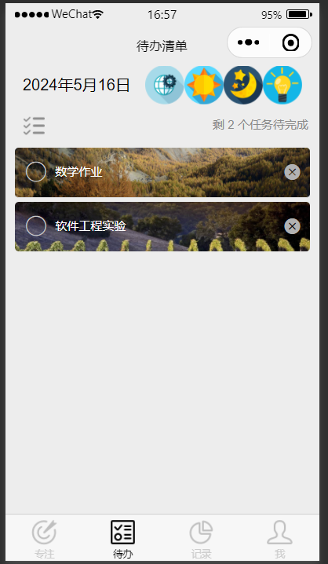
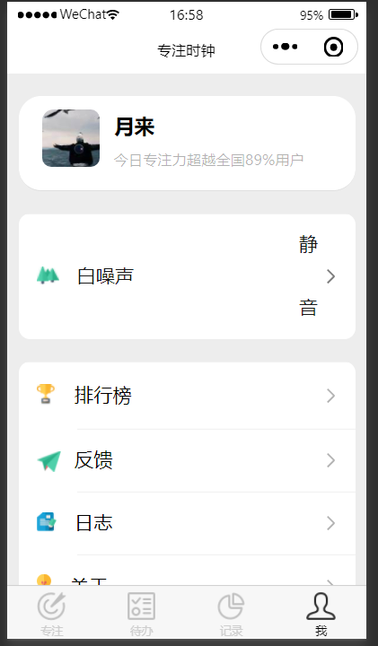

# 用户手册

[TOC]

## 引言

### 编写目的

​	本用户手册的编写旨在为使用FocusToDo小程序的用户提供详尽的操作指南和使用说明，帮助用户充分了解软件的功能特性，掌握软件的操作方法，有效提高工作和学习效率。

- **提供详尽的操作指南**：本手册将详细介绍FocusToDo小程序的各项功能和操作步骤，帮助用户快速上手，合理使用软件功能。
- **解答常见问题**：手册中将提供常见问题解答和故障排除方法，帮助用户在使用过程中遇到问题时能够及时解决。
- **指明读者对象**：本手册适用于所有希望提高工作效率和时间管理能力的个人和团体，包括但不限于学生、职场人士、自我管理者、创作者等。

### 项目背景

​	本FocusToDo小程序项目的实施是为了满足现代生活中对时间管理和工作效率提升的需求。该项目由开发者共同合作完成，旨在为用户提供一款简单实用、功能完善的时间管理工具。

**项目来源**

​	该项目源于对现代社会工作与生活压力不断增大的认识，人们对提高工作效率和管理时间的需求日益迫切。番茄工作法作为一种有效的时间管理方法，成为本项目设计的灵感来源。

**开发人员**

​	本项目的开发人员有：

- 向航
- 傅信燊
- 邓伟亮
- 吕韦辰
- 欧阳家睿

### 定义

​	本节将列出在本用户手册中使用的专门术语的定义和常见缩写词的原意，以帮助用户更好地理解相关内容。

**专门术语定义：**

1. **番茄钟工作法（Pomodoro Technique）**：一种时间管理方法，将工作时间划分为25分钟的工作段和短暂的休息时间，以提高工作效率和专注力。
2. **工作周期**：指番茄钟工作法中的一个完整工作流程，包括25分钟的工作时间和短暂的休息时间。
3. **休息时间**：在番茄钟工作法中，指每个工作周期后的短暂休息时间，通常为5分钟。
4. **任务记录**：记录每个工作周期的完成情况和工作内容，用于分析工作效率和时间利用情况。

**常见缩写词原意：**

1. **FAQ**：常见问题解答（Frequently Asked Questions）
2. **UI**：用户界面（User Interface）
3. **UX**：用户体验（User Experience）
4. **API**：应用程序接口（Application Programming Interface）
5. **OS**：操作系统（Operating System）
6. **CPU**：中央处理器（Central Processing Unit）

​	以上是本用户手册中可能涉及到的部分专门术语的定义和常见缩写词的原意。随着手册的编写和更新，可能会涉及到更多术语和缩写词，建议用户在阅读时参考本节定义以便更好地理解手册内容。

### 参考资料

本节列出了本用户手册编写过程中使用到的相关资料和参考文献，以供读者参考。

a. 开发计划文档：

- 作者：开发小组
- 标题：开发计划文档
- 日期：[2024/5/10]

b. 需求分析报告：

- 作者:开发小组
- 标题:需求分析报告
- 日期：[2024/5/10]

c. 软件设计说明书：

- 作者：开发小组
- 标题：软件设计说明书
- 日期：[2024/5/10]

d. 软件测试计划书：

- 作者：开发小组
- 标题：软件测试计划书
- 日期：[2024/5/10]

以上资料是本用户手册编写过程中参考和使用的重要文献和资料来源。读者可以根据需要参考这些资料，进一步了解项目背景、开发过程和软件设计实现。

## 概述

### 软件介绍

​	我们的软件是一款类似于番茄钟的时间管理工具，旨在帮助用户提高工作效率和时间管理能力。该微信小程序基于番茄工作法（Pomodoro Technique），通过将工作时间分割成间隔的工作和休息时间段，帮助用户保持专注并增强工作效率。

​	主要特点包括：

1. 简单易用的界面
2. 定制化的工作周期
3. 倒计时提醒功能
4. 任务记录和统计
5. AI助手

### 目标群体

​	我们软件的目标群体包括但不限于以下人群：

1. **学生**：
   - 希望提高学习效率和集中注意力的学生。
   - 需要管理学习时间和休息间隔的学生群体。
2. **专业人士**：
   - 需要提高工作效率和管理工作时间的职场人士。
   - 需要有效管理项目和任务时间的工作人员。
3. **自我管理者**：
   - 对时间管理感兴趣并希望提高个人效率的个人。
   - 希望通过科学的时间管理方法改善生活和工作质量的人群。
4. **创作者和艺术家**：
   - 需要保持创作状态和专注力的作家、艺术家等群体。
   - 希望提高创作效率和管理创作时间的人士。
5. **追求健康生活者**：
   - 希望通过规律的工作与休息周期改善健康的个人。
   - 注重工作与生活平衡的人群。
6. **团队和企业**：
   - 需要团队成员保持高效率和专注力的团队或企业。
   - 希望通过时间管理工具提升团队整体工作效率的组织。

总体来说，我们的软件适合所有希望通过科学的时间管理方法提高工作效率、保持专注力和提升生活质量的个人和团体。无论是学生、职场人士还是创作者，都可以从我们的软件中获得有效的时间管理支持和帮助。

### 版本信息

**版本 1.0**：

- 初始版本，包括基本的番茄钟功能：工作时间和休息时间的设定和倒计时提醒。
- 简单的界面设计和基本的工作周期记录功能。

**版本 1.1**：

- 添加了定制化工作和休息时间长度的功能，允许用户根据需求调整时间间隔。
- 优化了倒计时提醒和提示功能，提升用户体验。

**版本 1.2**：

- 引入了任务记录和统计功能，用户可以查看完成的工作周期和时间分布。
- 增加了报表和分析模块，帮助用户分析和优化时间管理效果。

**版本 1.3**：

- 引入更多定制化和个性化功能，如主题设置、提醒音效选择等。
- 增加社交分享功能，用户可以分享工作成就和效率提升经验。
- 改进用户界面和用户体验，提升软件的整体性能和稳定性。

**版本 2.0**（预期）：

- 提供了跨平台支持，包括桌面端和移动端应用，用户可以在不同设备上使用软件。
- 增加了数据同步功能，使用户可以在多个设备上同步工作周期记录和数据。

## 系统运行环境

​	本节将介绍FocusToDo小程序运行所需的硬件配置和支持软件环境。

### 系统硬件环境

FocusToDo小程序运行所需的最低硬件配置包括：

a. **计算机型号、主存容量**：

- 计算机型号：任何支持运行操作系统的个人电脑或移动设备。
- 主存容量：建议至少2GB RAM。

b. **外存储器、媒体、记录格式、设备型号及数量**：

- 外存储器：不需要额外的外存储器。
- 媒体和记录格式：不适用。
- 设备型号及数量：至少一台支持操作系统的计算机或移动设备。

c. **输入、输出设备**：

- 键盘和鼠标（或触控设备）用于输入。
- 显示器用于输出。

d. **数据传输设备及数据转换设备的型号及数量**：

- 不需要特殊数据传输或转换设备。

### 系统软件环境

​	FocusToDo小程序需要以下支持软件环境：

a. **操作系统名称及版本号**：

- Windows 7及以上版本
- macOS 10.12及以上版本
- iOS 11及以上版本（移动设备）
- Android 7.0及以上版本（移动设备）

b. **语言编译系统或汇编系统的名称及版本号**：

- 不需要特定的语言编译系统或汇编系统。

c. **数据库管理系统的名称及版本号**：

- 不需要数据库管理系统。

d. **其他必要的支持软件**：

- 无需其他特殊支持软件。

​	以上是FocusToDo小程序运行所需的硬件配置和支持软件环境。请根据实际情况和用户设备的具体配置，确保满足以上最低要求，以确保软件能够正常运行和稳定使用。

## 软件功能说明

​	本节将详细介绍番茄钟软件的各项功能模块，包括专注页面、待办事项、统计数据、个人中心和AI助手。

### 专注页面

**功能描述：**

- 专注页面是FocusToDo小程序的核心功能，用于设定工作时间和休息时间，启动番茄钟工作模式。
- 用户可以在专注页面设定工作时间和休息时间长度，开始专注计时。
- 在工作时间结束时，软件会发出提醒，用户可以选择开始休息或继续工作。

**页面展示**

### 待办事项

**功能描述：**

- 待办事项功能允许用户添加、管理和查看任务清单。
- 用户可以一键完成任务，也可以一键删除任务，或者在每一项结束后单独点击完成或者删除，便捷了用户的使用。
- 在专注页面可以选择开始待办事项。

**页面展示**

### 统计数据

**功能描述：**

- 统计数据模块提供用户的工作记录和时间记录数据。
- 用户可以查看工作周期记录、完成任务数量、工作时间分布等统计信息。
- 基于统计数据，帮助用户了解自己的工作习惯和效率水平。

**页面展示**

### 个人中心

**功能描述：**

- 个人中心是用户管理个人信息和偏好设置的地方。
- 用户可以在个人中心修改个人资料、更改设置、选择主题等。
- 个人中心也是用户反馈意见和联系技术支持的渠道。

**页面展示**

### AI助手

**功能描述：**

- 用户可以与AI助手交互，获取各方面的帮助和建议。
- AI助手可以帮助用户处理一些简单的工作，如编写一个简单的神经网络。

**页面展示**

以上是FocusToDo小程序的各项功能模块的详细说明。这些功能将帮助用户有效管理时间、提高工作效率，并提供个性化的时间管理支持和建议。

## 软件操作指引

​	进入小程序之后，首先完成一些基础选项的设置

### 设置

#### 工作、休息时间；振动、音效、专注熄屏

​	进入个人中心页面，设置中可以修改工作时间，休息时间，振动，音效，专注熄屏；这里的修改的时间为专注时最长设定的时间；

#### 白噪声背景音

​	个人中心首页即可修改白噪声，具有静音、林间、雨声等多种选项；

#### 头像、昵称

​	点击头像页面，自动申请使用微信权限，同意后，使用微信头像和昵称；

####  排行榜

​	邀请好友共同使用小程序，即可参与排行功能；

#### 日志功能

​	用户可以在这里记录自己的每一天；

​	了解这些功能后，用户可以开始准备添加事项，开始专注之旅啦！

### 添加待办事项

#### 添加

​	进入待办事项页面，点击左上角的小灯泡，输入事项名称完成添加：

#### 完成待办事件

​	勾选事项左方的圆圈，即可表示完成事项；选择左侧列表状图案，代表一键完成所有任务。

#### 早晚打卡

​	点击待办事项页面左上方的太阳（早上），月亮（晚上）即可完成对应打卡；打卡可以分享好友，也可以选择保存图片。

### 开始专注、休息

#### 设置本次专注的时间

​	点击上方倒计时时钟，即可设置本次专注的时间；

#### 开始专注

​	选择待办事项，点击工作或者休息；

### 查看数据统计

​	进入数据页面，即可查看自己每天的工作、休息记录；完成之后，点击下方垃圾桶图案，即可完成一键删除功能，或者点击右上方上传图案，可以实现打卡分享。

### AI助手

​	进入待办事项页面，点击左上方互联网标志，即可进入AI助手页面；同时需要启动server.py文件。

### 其他功能

#### 分享好友

​	在个人中心的最下方，就可以将这个有趣的软件分享给好友啦！

#### 反馈

​	点击反馈页面，即可进入小程序对于的github项目库反映问题啦！

​	手册到此结束啦，祝您使用愉快！

