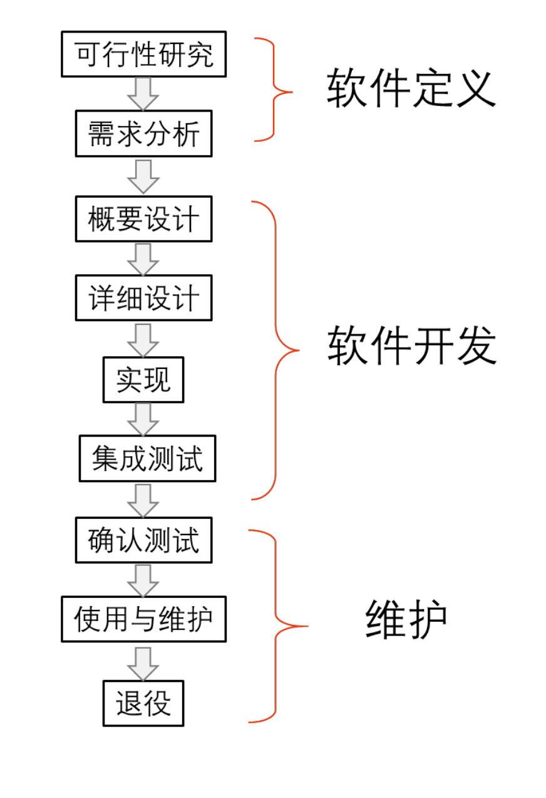
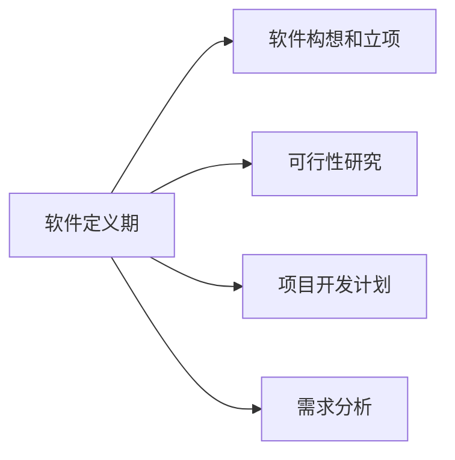
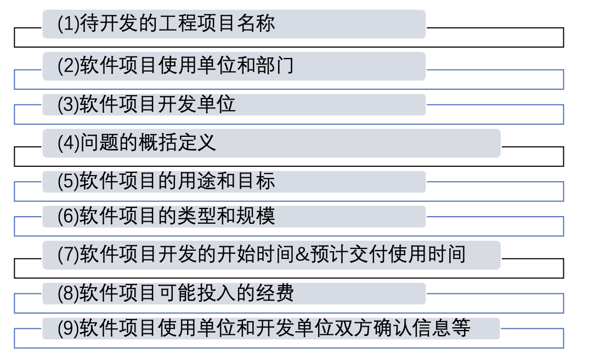
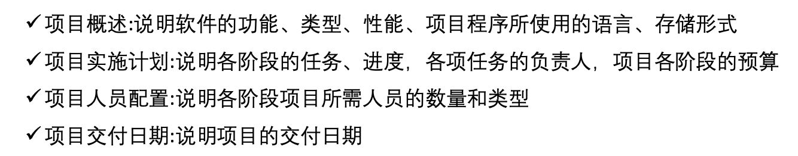
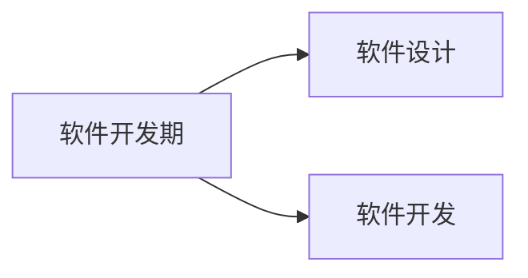
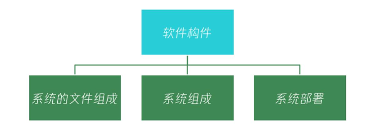
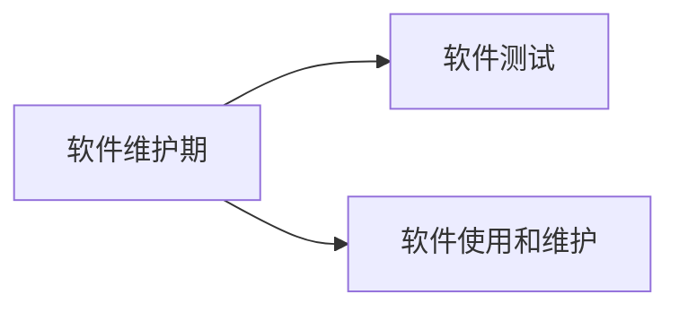

# *调研*

首先我们这个课是软件工程，最后是的大作业是对软件的设计，所以第一步要明确的就是我们最后要把什么东西呈现给老师，换句话来说就是：**软件的定义是什么？**

程序和数据就不用解释了，文档是指记录软件开发活动和阶段性成果，为理解软件所必需的阐述性资料，例如需求分析文档、软件设计文档等等。那么就已经很明确了，最后要交的东西就是**程序+文档**。

如果把完成这个作业的过程比作为盖楼房的话，我们现在做的事情是很投机取巧的，因为我们直接跳过了软件的需求分析、立项等等过程，而是有了一个prototype的程序，所以相当于我们的楼房已经盖好了中间的楼层，但是没有地基，也没有封顶。所以为了让这个项目健康地完成下去，我们必须清晰软件开发的整个流程。

那究竟该如何开发呢，换句话来问就是我们如何从零开始开发一个软件？这里就要引入一个概念：**软件的生命周期。**让我们看图来理解：

上图展示的就是软件生命周期的三个主要阶段：**软件定义期、软件开发期、软件运行和维护期**。下面我会对这三个阶段进行一一解读，并从这些阶段中把我们要完成的文档提炼出来。

## *软件定义期*

### *软件构想和立项*

软件构想和立项的定义是对软件的工作范围进行分析，寻找实现软件的可行解决方案，预测软件或应用的发展方向，为后期的软件开发做准备。**在这里我们需要完成的是==问题定义报告==，内容如下：**

但是鉴于我们的作业是没有甲方的，所以这个报告我们也只需要完成前六项即可。

### *可行性研究*

**这部分需要完成一个==可行性研究报告==**。

可行性研究是指针对项目构想的内容进行详细分析，包括技术可行性、经济可行性、操作可行性和社会可行性。其目的就是分析项目是否值得完成。鉴于我们作业的特殊性质，经济可行性暂且不用分析，技术可行性分析也不用分析，因为我们完成的软件非常简单，所以要做的事情就是操作可行性和社会可行性的调研。

操作可行性主要考虑目标软件的使用操作方式是否符合用户的技术水平和使用习惯。分析和论证目标软件系统在当前的法律和道德情况下，其运行方式、操作规程在用户组织或者环境内是否合理、合法，以及是否存在违规、侵权等一系列问题。

### *项目开发计划*

项目开发计划是对参与项目的人员、组织、进度、资金、设备、时间、资源等因素进行合理的规划，统筹管理整个项目的实施过程。**在这里我们需要完成==开发计划文档==，内容如下：**

项目开发计划文档一般包括项目概述、项目实施计划、项目人员配置和项目交付日期等内容。

当开发计划文档完成后，还需要对开发计划进行评审，经过多次评审和修订后，形成最终的项目开发计划文档。但这部分基本是做不了的，所以仅在文档中体现即可。

### *需求分析*

一般而言，软件需求包括业务需求、用户需求、功能需求和非功能需求四个层次。

1. 业务需求：立项项目的主要研发目的，是开发系统的主要目标。
2. 用户需求：指除业务需求以外，用户希望立项项目中提供的其他需求。
3. 功能需求：指在完成项目业务需求和用户功能需求时，软件系统需要提供的其他系统功能。

**这部分我们最好完成一个==需求分析报告==**，遵循以下步骤：

1. 需求获取：这里有很多方式，比如访谈、分发调查表、情景分析，但我们还是做问卷调研为主。
2. 需求建模：主要是对用户的需求内容进行建模，保证需求在描述和理解过程中不会失真。
3. 需求规格说明：描述软件系统必须实现的软件功能和性能，对软件必须实现的功能和性能，以及对系统开发约束进行了描述。
4. 需求评审（X）
5. 需求变更（X）
6. 需求跟踪（X）

**这个需求分析报告，包括上面的两个报告，我们肯定是不会写的，必须看下别人怎么写，然后仿照即可。**

## *软件开发期*

### *软件设计*

**这里需要完成==软件设计文档==。**

按照软件需求规格说明定义的内容来开展软件设计，完成目标软件的概要设计和详细设计，为后续的编码、测试和维护奠定基础。

1. 概要设计：确定软件系统中使用的数据结构、数据存储结构同时确定应用与操作用户、通信程序之间的接口交互方式

   

   这部分基本上有什么写什么就行。

2. 详细设计：对概要设计中规划的各项内容进一步细化，确定各模块。对软件项目的文件组成、系统组成和软件部署方式等内容以及数据结构、数据库或大数据等进行设计

   

   

### *软件实现*

1. 选择编程语言。
2. 注意编程规范和效率。

**这里需要完成==接口文档==和==数据说明文档==。**

## *软件维护期*

### *软件测试*

**最后需要完成==软件测试计划书==和==测试分析报告==。**

### *软件使用和维护*

**这里需要完成==用户手册==。**